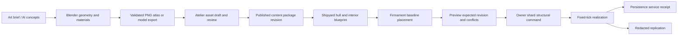

# Modular Space Assets and Walkable Interiors Plan

Status: Active
Lifecycle: source-of-truth
Category: plan
Last updated: 2026-09-06
Owners: architecture + art + gameplay + replication + client + dashboard
Scope: Integrate Blender-authored modular ships/stations and walkable interiors with original authoring and durable live state.
Source of truth: yes
Supersedes: n/a
Superseded by: n/a
Primary references:
- docs/reports/audits/modular_space_assets_audit_2026-09-06.md
- docs/features/active/ship_construction_blocks_contract.md
- docs/plans/proposed/ship_construction_blocks_system_v1_plan_2026-06-13.md
- docs/features/active/dashboard_game_authoring_runtime_contract.md
- docs/decisions/dr-0040_distribution_and_persistence_authority_model.md

## 0. Status — 2026-09-06

2026-09-06 crew implementation update: the attached-character slice of C/D now has
compiled floor/fixture collision, server-owned cockpit interaction, fixed-step
local movement, f64 moving-frame projection, private occupant snapshots and a
layered Blender avatar. See the current [crew contract](../../features/active/crew_interiors_contract.md).
Station door traversal, inter-vessel boarding/EVA, delegated piloting and passenger
transport handoff acceptance remain separate follow-through work.

2026-09-06 initial investigation delivered the 73-frame Blender MCP prototype.
The library now has 201 frames and six reusable faction themes, including three
rocket-pod sizes, fusion/ion pods, compact side jets and eight-frame airlocks.
Albedo, normals, emission and a shaded pixel-sprite channel retain editable Blender
geometry. The runtime shader adds independently driven exhaust at physical nozzles.

2026-09-06 implementation now includes shared hull compilation, persisted mounted
fittings, polygon mass/inertia/centroid, compound collision, fixed-tick directional
IFCS, private cutaway/public roof replication and the Shipyard 2.3 layer editor.
The full current behaviour and limitations are recorded in the construction
contract. Station walking, moving interiors, damage splitting, full equipment
simulation and live source-to-instance structural rebuild remain open. This does
not mark every future phase complete or claim a 3D-rendering performance trial.

This plan extends the existing construction direction; it does not waive DR-0040,
the engine/content boundary, or durable owner-shard authoring. Interiors, formerly
deferred from construction V1, are now part of the requested product direction.
The original WS2–WS8 dependency order still governs the exterior implementation.

## 1. Target workflow

Art source is versioned separately from authored gameplay definitions. Publishing
asset bytes changes presentation; saving an original hull/baseline does not
implicitly overwrite an evolved live instance. The dashboard exposes those actions
and durable receipts through the existing authoring contract.

## 2. Art and scale contract to ratify

- Retain existing square construction grid, `+Y` north and clockwise cardinal
  block facing. Prototype uses the existing **2 m cell** and **64 pixels/cell**.
  Keep pixels/metre uniform across crew, rooms and exterior parts. A 128 px source
  frame is an export working resolution, not a second gameplay scale.
- Exterior roofs/armor, interior floors, edge walls/doors, fixtures, overheads,
  damage overlays and actors are separate visual layers. Roofs can be omitted
  without deleting structure. A structural block can reference several visual
  pieces; a visual tile need not be a functional block or ECS entity.
- Multi-cell visual bounds need an explicit anchor/pivot and crop rectangle.
  Decorative overhang is separate from occupied cells and exhaust clearance.
  Edge anchors must be represented directly; do not encode half-cells by rounding
  authoritative world coordinates.
- Atlas IDs are stable logical IDs; byte hashes identify revisions. Frames carry
  rect, pivot, physical size, channel references, orientation and animation
  timing. Normal vectors are local to the hull and rotate with it. Linear normal
  data must not be imported as sRGB or palette-quantized.
- Preserve unlit albedo plus normals/emission for a future normal-mapped material.
  The initial 2D client uses shaded pixel sprites under Lighting V2 modulation;
  their baked model-space key rotates with the hull, a documented presentation
  limitation of this cut rather than a physically correct moving light response. Pixel presentation uses
  nearest filtering and edge extrusion; large-distance filtering/LOD needs its
  own validated strategy.
- The current `sidereal.art.prototype.v1` manifest is **review-only**, not a new
  live gameplay schema. Do not silently register it as a runtime component.

Production library coverage beyond the current sample:

| Family | Required coverage |
|---|---|
| Decks | Plain/grate/service/cargo/medical floors, transitions, wear variants, hatches |
| Bulkheads | Straights, convex/concave corners, endcaps, T/cross joins, windows; complete edge anchors |
| Hull | Interior fill, edges, 45-degree/chamfer pieces, convex/concave corners, bow/stern shapes; deliberate silhouette families |
| Doors | Single/double, airlock, open/closed/opening/closing/locked/damaged; collision changes tied to server door state |
| Machinery | Bridge, reactors, batteries, main/manoeuvring thrusters, fuel, cargo, scanners, shield/jump units; multi-cell footprints |
| Mounts | Fixed/turret bases, independent barrels, slew pivots, muzzle and exhaust sockets |
| Rooms | Bridge, engineering, cargo, habitation, medical and docking fixtures; collision and access data |
| Crew | Readable scale, idle/walk/interact/hurt states and direction coverage; current four frames are only a scale test |
| Damage/effects | Breaches, scorch/debris overlays, damaged modules, emissive warning states; functional damage implemented separately |

Do not call the library complete based on image count. Completion means coverage,
seam-free assembly, readable silhouettes and consistency in actual gameplay views.

## 3. Implementation sequence and acceptance

### A. Rendering and scale trial — next

Build one shared client preview plugin, separate from live spawns, that can show
the same station and ship using atlas tiles or instanced meshes. For 3D use an
orthographic Camera3d on a distinct render layer, floating-origin presentation
coordinates and an explicit composition order with backgrounds/effects/UI.
Connect Lighting V2 deliberately; do not double-light with PBR plus a sprite light
pass. Add an authenticated, byte-backed model loader if selecting glTF/GLB.

Benchmark native and WebGPU: 1/25/100 nearby hulls plus one detailed station,
several camera rotations/zooms, roof transitions and asset-cache reloads. Measure
CPU/GPU frame time, draw calls, geometry, texture/model memory, asset bytes and
join delay against the existing sprite client on the same hardware. Set budgets
from those measurements. Batch by material/chunk; no per-bolt render entities in
the game. The Blender study deliberately retains editable objects and is not an
optimized runtime mesh package.

Exit: agreed renderer and scale, correct depth/lighting, native/WASM compile and
visual parity, measured costs. Keep source exports available for the other path.

### B. Authoritative assembled exterior — original WS2–WS8

Add content-side hull realization from pinned block/hull package revisions;
hybrid structure data plus functional child entities. Complete placement/edge
validation, contribution aggregation, block-derived compound collision, CoM and
inertia. Extend only generic mass primitives in engine-physics. Connect geometric
thruster allocation and turret/loadout behavior in the documented order. Keep the
existing ship type available until the replacement passes acceptance.

Persist the canonical structure/revision and functional state, regenerate derived
physics deterministically on hydration, and replicate redacted structure. Add
the shared baseline compiler realization and a structural owner command with
expected layout/version, rather than using unrestricted component JSON edits.

Exit: modular scout and static station spawn; flight/weapon geometry works;
restart retains layout/state; stale edits fail; clients render the same revision;
empty/noop writes do not pretend to be new durable mutations.

### C. Station interiors and walking

Introduce generic spatial-frame/deck-local pose, edge collision and interaction
mechanisms where reusable by an RPG. Ship/deck content, rules and fixtures remain
in sidereal-game and content packages. Persist player UUID → hull UUID/deck/local
f64 pose on player ECS components. Do not create account-local or SQL character
position stores. Define an indoor movement controller at human scale rather than
reusing the free-space 220 m/s default.

Implement stationary station walking first: floor coverage, edge walls/doors,
interaction reach, navigation, room access and camera/roof behavior. External
collision and interior collision use separate domains. Shared fixed-step input
logic provides prediction; server validates movement and interactions.

Exit: two real clients board the same station, see permitted occupants, cannot
cross closed walls, operate a persisted door, reconnect to their persisted deck
location, and retain location/door state after server restart.

### D. Moving hull interiors, docking and ownership

Derive `world_position = hull_position + rotate(hull_angle, local_position)` in
f64 on the owner shard. Account for hull translation and angular motion in the
boarding/disembark velocity conversion. Choose one authoritative motion writer
per mode; never integrate local walking and world physics independently.

Docking/boarding is an explicit server transition: validate proximity, access,
door state and destination occupancy; atomically change the player's frame/control
binding. Keep piloting and walking separate from account identity. Freeze the
ownership group during handoff and hydrate hull, functional children and attached
crew without changing UUIDs. Carry navigation/door/layout revisions coherently.

Exit: character stands still relative to an accelerating/rotating hull, walks
without drift, changes control at a console, boards/disembarks once, reconnects
correctly and survives a shard handoff with no duplication or permanent deletion.

### E. Full dashboard authoring and original/live parity

- **Atelier:** asynchronous Blender/export jobs, provenance/source downloads,
  staged atlas/model import, matching channel/pivot previews and asset ID creation.
  Keep Blender off the public HTTP request path and the simulation host's tick.
- **Shipyard V2:** real visual palette, rotate/mirror multi-cell blocks, roof/deck
  switch, interior floor/edge/fixture editing, walking clearance and class budgets.
- **Foundry:** package code and lifecycle editing for authored machine/door/console
  behavior through existing sandbox hooks. Expose explicit typed interaction APIs;
  never let an asset-generation prompt author authoritative gameplay state directly.
- **Firmament:** place hull/station package revisions in the original world,
  preview baseline changes, apply by expected revision/projection hash and show
  per-shard persistence receipts.
- **Live entities:** structural preview computes affected actors/collision/nav.
  Initially reject edits intersecting occupied cells. Capture reviewed live
  values into an original authoring draft through the existing capture lane.

Exit: dashboard publishes a station, places it in a baseline, applies it live,
edits a door callback and a room boundary, reports conflicts/durability correctly,
and preserves both original source and evolved state after restart.

### F. Production art and cutover

Complete the coverage matrix using the selected renderer. Optimize meshes or
atlas chunks without changing semantic IDs. Re-author starter hulls, validate
physics/crew/asset delivery and remote downloaded-client acceptance, then execute
the existing late cutover/reset procedure and remove retired hardpoint schemas.
Do not reset a working world merely to demonstrate the art prototype.

## 4. DR-0040 answers for proposed runtime state

1. **Owner:** the hull's owner shard owns its structure, doors and functional
   blocks; attached crew's local-frame simulation joins that ownership group.
   Station regions follow normal spatial ownership, not a global station server.
2. **Handoff:** freeze/transfer the group and durable revision together; mirrors
   remain ghosts. Preserve IDs, pending receipts and completed lifecycle state.
   Unload/handoff never performs permanent graph deletion.
3. **Cross-shard visibility:** exterior public structure through the normal
   visibility lane; interior/crew/fixture state only through authorized scoped
   delivery with redaction. Asset availability does not itself grant state access.

## 5. AI-assisted art workflow

Use AI image generation for palettes, silhouette families and concept exploration.
Use reviewed agent-authored Blender scripts for dimensioned, reproducible meshes
and repeatable exports. Optional image-to-3D services can provide starting shapes,
but their outputs need scale/topology/material cleanup and measured cost/licensing
review before use; none is required by the working local pipeline.

Stage generated outputs, retain source/tool versions, inspect at actual pixel size,
validate seams and rotation, then refine pixels in Atelier or an external pixel
editor. Publication is a content revision, with gameplay metadata supplied by the
canonical construction schema and validated on the server. Batch generation should
use queued jobs, progress/errors and last-good published artifacts.
