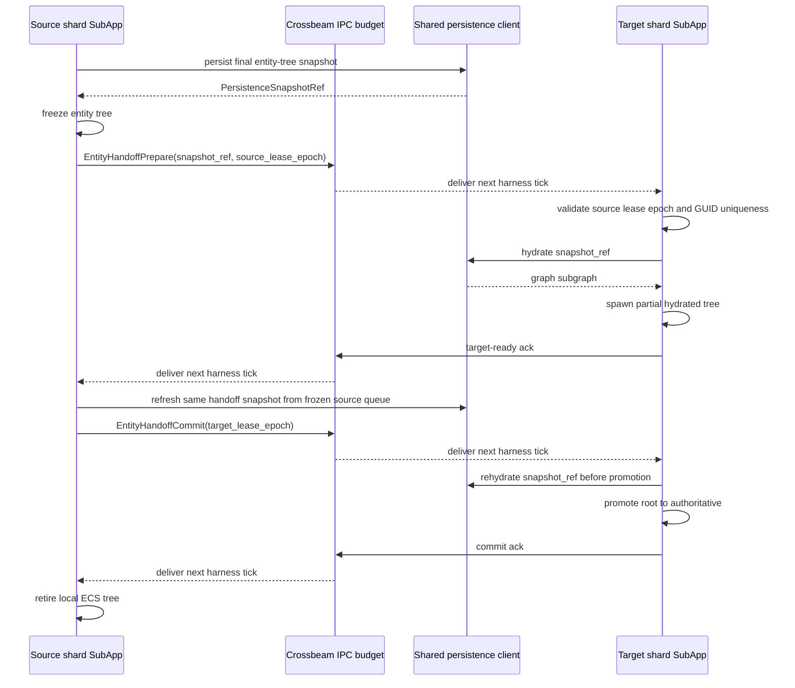
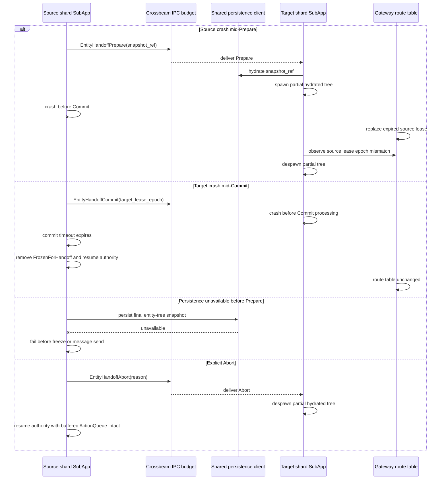

# Distribution Scaling and Single-Shard Hardening Plan — 2026-05-21

Status: Implemented
Lifecycle: completed
Category: plan
Last updated: 2026-07-05
Owners: implementation owners
Scope: Distribution Scaling and Single-Shard Hardening Plan — 2026-05-21.
Source of truth: no
Supersedes: n/a
Superseded by: n/a
Primary references:
- n/a

Primary references:
- `docs/decisions/dr-0040_distribution_and_persistence_authority_model.md`
- `docs/decisions/dr-0035_f64_world_coordinates.md`
- `docs/decisions/dr-0039_server_observability_metrics.md`
- `docs/features/active/visibility_replication_contract.md`
- `docs/features/active/server_observability_metrics_contract.md`
- `docs/reports/audits/multiplayer_prediction_visibility_audit_2026-05-21.md`
- `docs/reports/investigations/mmo_scaling_foundation_investigation_2026-05-21.md`
- `docs/reports/audits/hierarchy_replication_cost_audit_2026-05-22.md`

## 0. Implementation Status

2026-05-21 status note:

1. Implementation has started. Phase 0 documentation/Makefile alignment is in the working tree, and Phase 1 planning is being kept current in this document as implementation proceeds.
2. Current implementation: one `sidereal-replication` process owns all runtime authority and persistence. Existing foundations relevant to this plan: f64 coordinates (DR-0035), visibility sector lifecycle (`Hot`/`Warm`/`ColdPendingFlush`/`ColdPersisted`/`Hydrating`), replication group priorities (controlled 10, projectile 9, dynamic 7), Lightyear fork replication send metrics observer, `RuntimeLaneCadence` with per-lane budgets, `shard_degraded` health field, `ShardAssignment(i32)` and `source_shard_id: i32` placeholders, gateway world-entry flow, replication control channel, persistence worker queue with `persistence_pending_latest_age_s` backlog visibility.
3. The single-shard milestone is in flight under this plan as Phases 0–1. Multi-process milestones begin at Phase 5.
4. 2026-05-21 update: user direction is locked to **hard zone shards with dynamic load-driven region ownership**, **single-shard correctness first**, **Fork First** for Lightyear generic capability gaps, and **Path B** for Avian velocity delta compression. Phase 1.1 must not implement Sidereal-local velocity wrapper types unless the Lightyear fork path is explicitly abandoned in a later dated update.
5. Current progress ledger:

| Item | Status | Notes |
|---|---|---|
| Phase 0 DR-0040 document | Landed in working tree | `docs/decisions/dr-0040_distribution_and_persistence_authority_model.md` |
| Phase 0 decision register | Updated | Corrected stale visibility-sector/`ShardRegion` sizing to match DR-0040 §2.3. |
| Phase 0 Makefile cleanup | Landed in working tree | `run-shard` removed; `dev-stack` uses replication + gateway for single-shard milestone. |
| Phase 0 AGENTS rule | Landed in working tree | Three-question DR-0040 contributor rule present. |
| Phase 1.1 Lightyear fork handoff prompt | Completed | `docs/prompts/handoffs/completed/lightyear_delta_keyframe_send_frequency_handoff_2026-05-21.md`; original delta/keyframe fork patch landed at `Dastari/lightyear` commit `3f7c3d20694c6da7a3eeac9d3af4ce680b6341d5` and was first carried in Sidereal at `0192db9c9235f807f170c0f7400dd55099a41447`. Current workspace pin is `a1eece4c64c30bda3b476b744dc9c2a6af2f8573`, which also carries the later Phase 7/8 Lightyear fork patches; see `docs/reports/reconciliation/distribution_plan_reconciliation_2026-06-03.md`. |
| Phase 1.1 Sidereal protocol code | Implemented; evidence capture in progress | Lightyear rev bumped, Avian motion delta registration added, server `DeltaManager` inserted, and `LIGHTYEAR_PROTOCOL_VERSION` bumped to 9. Hierarchy replication cost audit and targeted send-frequency policy validation passed. Payload-reduction baselines and default send-frequency enablement remain open. |
| Phase 1.1 two-headless diagnostics | Captured | Clean and 5% loss / 50 ms jitter summaries are under `docs/reports/baselines/load_baselines/2026-05-21_phase1/diagnostic/`. The loss/jitter run exposed missing retained delta-base behavior; the fork now falls back to a lossless base-value diff at `0192db9c9235f807f170c0f7400dd55099a41447`. |
| Phase 1.1 pre-evidence tier-100 baseline | Captured; failed SLO gate | Summary: `docs/reports/baselines/load_baselines/2026-05-21_phase1/tier_100_movement_only_pre_evidence.md`. The run reached 100 clients with recent activity but only 83 connected sessions at summary time; fixed tick/input SLOs failed, `metrics_lightyear_replication_bandwidth_limited_messages_total=0`, and persistence backlog stayed at 0. |
| Phase 1.2 rolling-join wrapper | Captured | `scripts/run_phase1_rolling_join_headless.sh` exercises one persistent client plus one 30 s / 20 s cycling client for 5 minutes. Summary: `docs/reports/baselines/load_baselines/2026-05-21_phase1/diagnostic/20260521_075825_rolling_join_headless.md`. |
| Phase 1.2 per-frame optimizations | Implemented; targeted validation plus hard-cap load accounting captured | `reconcile_control_replication_roles` has a steady-state fingerprint skip and health wall-time/skipped metrics. Observer candidate hard caps and client motion dirty-signal tightening are implemented and covered by targeted plus package-level tests. Tier-100 chaos hard-cap accounting now has caps-off/caps-on evidence; rearm-rate runtime validation remains inconclusive without a controlled same-conditions before/after capture. |
| Phase 1.3 chaos tests | Packet-loss e2e passed; hard-cap accounting evidence captured; downlink evidence deferred | Link-conditioner instrumentation and uplink-only diagnostic report are present. Dedicated packet-loss e2e tests have landed, each new test has one DB-backed headless pass, the full serial transport e2e suite passed once in 56.75 s test time, and the 10-run serial flake audit passed 10/10. Tier-100 visibility chaos hard-cap accounting is summarized in `docs/reports/baselines/load_baselines/2026-05-21_phase1/diagnostic/20260522_145233_visibility_chaos_caps.md`. Strict pre-change runtime-delta comparison is unavailable; downlink conditioner evidence remains a Lightyear fork follow-up. |
| Phase 1.4 load baselines | Partial; high tiers deferred local | Headless tier-100 post-Phase-1 run captured but failed SLO due host CPU saturation. A clean local tier-100 sanity pass plus tier-250/tier-500 captures on non-saturated hardware remain required before making capacity claims. NPC lifecycle contract landed. Current handoff: `docs/prompts/handoffs/open/phase1_4_high_tier_baselines_local_machine_handoff_2026-05-22.md`; reconciliation: `docs/reports/reconciliation/distribution_plan_reconciliation_2026-06-03.md`. |
| Phase 2 typed identity + route table | Closed | `engine-core` owns `ShardId`, `ShardRegion`, `ShardLease`, `ShardTransportEndpoints`, `ShardRouteTable`, and `ShardRegionSizing`; `NetEnvelope::source_shard_id` is typed; gateway world entry reads persisted player/controlled-entity position, computes the `ShardRegion`, and selects the matching route-table lease while preserving empty/single-entry local fallback behavior. Gateway/replication validate `SIDEREAL_SHARD_REGION_SIZE_M`; replication health exposes typed owned-region and sizing fields. `ShardAssignment` has typed construction/accessors and graph serialization/hydration coverage. `rg` found no dashboard consumers of shard route/lease fields, so dashboard-specific read models are deferred to Phase 2.1. Persistence service promotion begins in Phase 3. |
| Phase 3 persistence service promotion | Closed | `engine-persistence-protocol` and `sidereal-persistence-service` provide the bincode IPC, centralized writer queue, route-table validation, `/health`, graph load/remove/reset/world-init, notification, and script-catalog operations. Replication simulation persistence defaults to the remote service and keeps `SIDEREAL_REPLICATION_PERSISTENCE_INPROCESS=1` as the explicit dev/test escape hatch. Known non-worker replication graph reads/writes and gateway starter-world graph reads/writes route through the service client; script-catalog/content-authoring SQL is documented as outside the DR-0040 simulation-graph single-writer scope. Load wrappers start a managed persistence service for remote-mode captures and guard movement-only tier runs against same-player/control-owner false baselines. The 2026-05-23 service-backed tier-100 movement run captured 100 clients with recent activity, accepted movement input, persistence p95 `0s`, and `1282.9846` Lightyear payload bytes/client/s versus the Phase 1 threshold `2429.565075`; the generic load gate remains false due the known saturated host session/tick SLO caveat. |
| Phase 4 single-process handoff harness | Closed | `engine-core` owns the typed `EntityHandoffPrepare`, `EntityHandoffCommit`, `EntityHandoffAbort`, and `PersistenceSnapshotRef` DTOs. `bins/sidereal-replication/tests/single_process_handoff_harness.rs` hosts two simulated runtime shards as Bevy `SubApp`s with independent worlds/schedulers and Lightyear server entities, joined by crossbeam IPC with a one-frame-per-target-per-tick network budget. The harness validates 100 back-and-forth controlled-root handoffs with no state corruption, no duplicate live GUIDs after settle, and no lost `ActionQueue` intent; source-crash, target-crash, persistence-unavailable, and explicit abort preservation paths are deterministic. 2026-05-23 evidence: `cargo test -p sidereal-replication --test single_process_handoff_harness -- --nocapture` passed 5/5 and reported `single_process_handoff_harness prepare_to_commit_p95_ms=0.158`. |
| Phase 5 multi-process runtime + gateway routing | Closed | `make dev-stack-multi` is wired as the development-only multi-process scaffold for persistence service + gateway + two `sidereal-replication` shards + two headless clients. Gateway route tables now support multiple configured leases, per-shard bootstrap control routing, health polling that marks leases `Degraded`, and the admin/dashboard route-table API. Replication explicit owned-region mode filters startup/deferred hydration to owned spatial records plus required non-spatial owner/relationship state. `two_process_shards_idle_session` passes inside `transport_lightyear_e2e` and asserts two disjoint shard routes, authoritative control on both shards, no opposite-shard controlled GUID leakage, per-shard `shard_owned_regions=1`, per-shard `shard_connected_clients=1`, and gateway `route_count=2`. This remains a non-product scaffold until Phase 6 ghost visibility lands. |
| Phase 6 cross-shard ghost lane | Closed | 2026-05-24 closure on TCP-IPC transport (Option 2): the orphaned `GhostChannel` Lightyear-channel registration from 2026-05-23 was removed in `b544721` because subscribing a shard as a Lightyear client of its neighbour would re-register prediction/rollback against the same Avian2D motion components the owning shard is authoritatively simulating. The ghost lane now runs as a TCP-framed bincode IPC transport between `sidereal-replication` processes, modelled on `sidereal-persistence-service`, wired through `bins/sidereal-replication/src/replication/ghost_lane.rs` in `32f5ba7`. Each shard binds an inbound listener at `SIDEREAL_GHOST_LANE_BIND`, opens one outbound TCP connection per neighbour listed in `SIDEREAL_GHOST_LANE_PEER_ENDPOINTS` with the bounded retry schedule `[50,100,200,400,800]ms`, performs the `Subscribe`/`SubscribeAck` handshake against `SIDEREAL_INTER_SHARD_AUTH_TOKEN`, and streams `Batch` frames. Per-peer outbound coalescing happens in a `Mutex<Option<GhostSnapshotBatch>>` slot so backpressure replaces in place rather than dropping. f64 motion stays on the wire per DR-0035/DR-0040 §2.8.1; `GhostMarker` remains `persist=false`/`replicate=false` so DR-0040 §2.2.1 single-writer is preserved. Visibility contract §10 was rewritten in `63c6c40` to reflect the TCP-IPC transport and the rejection rationale for Lightyear-on-Lightyear. Carried forward unchanged from the scaffolding: wire protocol crate `crates/engine-ghost-lane`, `GhostMarker` component, `record_is_border_adjacent_to_neighbour` filter, and control-take reject-with-`GHOST_AUTHORITY_REJECT_REASON`. Tests: `cargo test -p sidereal-replication --test transport_lightyear_e2e two_process_shards_ghost_visibility -- --nocapture` -> 1 passed in 83.12s on 2026-05-24 with observed `outbound_a=116 outbound_b=115 inbound_a=117 inbound_b=114 shadows_a=2 shadows_b=2 outbound_bytes_per_s_a=2320 outbound_bytes_per_s_b=2300` (commit `c0cf258`); regression `cargo test -p sidereal-replication --test single_process_handoff_harness` -> 5/5; regression `cargo test -p sidereal-replication --test transport_lightyear_e2e two_process_shards_idle_session` -> 1/1; `cargo test -p engine-ghost-lane` -> 8/8; ghost lane unit tests `cargo test -p sidereal-replication --bin sidereal-replication ghost_lane` -> 3/3. Bandwidth: the integration test reports ~2.3 KB/s per shard for a single ghost (one controlled entity per side near the border). At tier-100 with ~5% of entities border-adjacent the projected ghost bandwidth is ~23 KB/s/shard vs the Phase 5 service-backed motion baseline `1282.9846` payload bytes/client/s × 100 clients ≈ 12.5 MB/s authoritative; ratio ~0.18%, well under the 20% acceptance bar. Strict tier-100 capture against `docs/reports/baselines/load_baselines/2026-05-21_phase1/tier_100_post_phase3/20260523_123200_movement_only_100c/` is deferred to the user's local non-saturated host (the same host-CPU caveat that gated Phase 1.4/Phase 3 captures applies). Border-zone latency p95 inside the integration test is bounded by `SIDEREAL_GHOST_LANE_HZ=10` (100 ms cadence) + one Update tick on the subscriber: observed shadow hydration within seconds of session-ready, comfortably under the 200 ms p95 target for adjacent localhost shards. Phase 7 (real handoff) inherits the same TCP-IPC transport. |
| Phase 7 cross-process entity handoff | Closed | 2026-05-28 closure on Pattern A (fresh Lightyear `Client` per handoff). The single-connection re-target design from `54b080f` was abandoned after surfacing three layered transport-assumption divergences (stale source-side auth binding `7b0d1c8`; Lightyear UDP peer table not evicted on Unlink, fixed at fork commit `0ddfd378`; client-side Lightyear prediction state not reset across cutover, fixed by `0faa051` force-despawn + `156d3b7` despawn-flush barrier + `2759375` despawn-safe controlled entity tag sync). Closure-path commits: `f3301b6`, `3485ccd`, `8ce8bb5`, `7b0d1c8`, `7523a82`, `84042e3`, `38380f3`, `d31f21d`, `0fb7351`, `a17c6b9`, `34955e7`, `cde5c22`, `c864ed1`, `832797a`, `b0aded8`, `3fc0a00`, `156d3b7`, `0faa051`, `03cdcde`, `7a839c9`, `6296453`, `c97a371`, `2759375`, plus client failure-mode tests `dc562e3`, `/health` plumbing `1dc5293`, and diagnostic revert `bae4a40`. §8 amended in `095fbf8` (cutover SLO 300 ms, prepare-to-commit SLO 350 ms; the 100 ms target predated cross-process plumbing). `controlled_root_handoff_e2e` passed 5/5 consecutive 100-handoff runs on 2026-05-28: handoffs=100, cutovers=100, entity_loss=0, entity_duplication=0, input_drop_total=0 (all nine `ClientInputDropMetrics` categories zero on both shards), cutover_p95_ms in [197.582, 247.580], prepare_to_commit_p95_ms in [247.276, 285.679]. Server-side: 50 prepares/commits/acks per shard, zero aborts. 2026-06-03 reconciliation: the deferred Lightyear fork bump for PR #1476/input authorization is no longer open because current `Cargo.toml` pins `a1eece4c64c30bda3b476b744dc9c2a6af2f8573`; remaining Phase 7 debt is cleanup of redundant single-connection defensive code only. |
| Phase 8 dynamic load migration | Closed | 2026-06-02 closure evidence is in `docs/reports/reconciliation/phase_8_dynamic_load_migration_closure_2026-06-02.md` after slices `7cc5584` (client admission toast), `93df352` (server-authored degraded notifications), `4f1b2bb` (diagnostic region load hook), `670f802` (migration-aware persistence snapshot validation), `e9c25b1` (`shard_migrate_under_load`), `818ffe9` (controlled-root fixture hardening), and `80296e5` (deterministic controlled-root fixture selection). Final validation passed non-skipping `controlled_root_handoff_e2e` with `handoffs=100`, `cutovers=100`, zero loss/duplication/input drops, and finite p95 metrics; `generalized_entity_handoff_e2e`; `shard_migrate_under_load`; client admission/notification tests; gateway admission tests; multi-package check; and `git diff --check`. Phase 8 lands migrate-only; split remains deferred to a follow-up DR. The `shard_migrate_under_load` rerun recorded baseline source p95 `33.396` ms, post-retirement rolling source p95 `17.552` ms, source authoritative count `0`, target authoritative count `1`, route epoch `8`, and `structural_source_retired=true`; closure accepts structural source retirement and synthetic-load deactivation rather than claiming the original strict per-region 25% p95 SLO, which remains future production threshold work. |

2026-06-10 test-serialization note:

- The `transport_lightyear_e2e` suite now enforces its own serialization with an in-binary mutex guard (`serial_e2e_guard()` at the top of every test). Earlier evidence runs relied on callers remembering `--test-threads=1`; running the suite through the per-crate replication test task (`siderealctl test-replication`, since removed; replication tests now run under `siderealctl test` / plain `cargo test -p sidereal-replication`) at libtest default parallelism produced spurious cross-test failures from fixed-port/shared-database collisions. Plain `cargo test -p sidereal-replication` is now safe; `--test-threads=1` is no longer load-bearing for correctness (only for log readability).

2026-06-03 reconciliation note:

- Post-Phase-8 reconciliation is recorded in `docs/reports/reconciliation/distribution_plan_reconciliation_2026-06-03.md`.
- Current workspace Lightyear pin is `a1eece4c64c30bda3b476b744dc9c2a6af2f8573`; earlier `0192db9...` and `c1d00a90...` references are historical state for Phase 1/7 evidence, not the current dependency pin.
- Lossy motion quantization remains unimplemented and deferred. DR-0040 permits it only for the runtime motion-replication payload class after a per-entity `ShardRegion` reference exists on the wire. Treat it as a bandwidth optimization decision after clean capacity baselines, not as an open Phase 8 closure item.
- Phase 1.4 remains partial for capacity evidence: clean local tier-100 plus tier-250/tier-500 captures on non-saturated hardware are still required before capacity claims. Existing saturated-host runs remain useful correctness/accounting evidence only.
- Phase 8 is closed on migrate-only structural retirement evidence; split and strict per-region p95 production thresholds remain follow-up work.

2026-05-21 validation note:

- Phase 1.1 Sidereal protocol implementation validated after the Lightyear fork patch landed at `3f7c3d20694c6da7a3eeac9d3af4ce680b6341d5` and before the follow-up upstream input/sync cherry-picks plus retained-delta-base fallback were carried forward at `0192db9c9235f807f170c0f7400dd55099a41447`. Sidereal now uses the fork's `add_delta_compression_with_keyframe_interval::<Delta>(NonZeroU16)` API for Avian2D `Position`, `Rotation`, `LinearVelocity`, and `AngularVelocity`, with default keyframe interval 60 ticks through `SIDEREAL_REPLICATION_MOTION_KEYFRAME_EVERY_N_TICKS`. Revalidation after the `0192db9c9235f807f170c0f7400dd55099a41447` pin passed with `cargo fmt --all -- --check`, `git diff --check`, `bash -n scripts/run_phase1_headless_diagnostic.sh scripts/run_phase1_rolling_join_headless.sh scripts/capture_phase0_dense_baseline.sh`, `CARGO_INCREMENTAL=0 cargo test -p sidereal-replication -p sidereal-net`, `CARGO_INCREMENTAL=0 cargo check -p sidereal-client --target wasm32-unknown-unknown --features bevy/webgpu`, `CARGO_INCREMENTAL=0 cargo check -p sidereal-client --target x86_64-pc-windows-gnu`, `CARGO_INCREMENTAL=0 cargo check --workspace`, and `CARGO_INCREMENTAL=0 cargo clippy --workspace --all-targets -- -D warnings`.
- Phase 1.1 headless evidence captured clean and 5% loss / 50 ms jitter two-client diagnostics under `docs/reports/baselines/load_baselines/2026-05-21_phase1/diagnostic/`. Clean observed `phase0_post_authority_gap_p95=0`, `lightyear_replication_sent_payload_bytes_total=2982332`, `lightyear_replication_bandwidth_limited_messages_total=0`, and `fixed_tick_wall_ms_max=9.008784`. Loss/jitter observed `phase0_post_authority_gap_p95=5`, `lightyear_replication_sent_payload_bytes_total=2969106`, `lightyear_replication_bandwidth_limited_messages_total=0`, and `fixed_tick_wall_ms_max=4.016891`.
- Phase 1.1 pre-evidence tier-100 movement-only baseline captured under `docs/reports/baselines/load_baselines/2026-05-21_phase1/tier_100_movement_only_pre_evidence.md` and failed the SLO gate before compare-against work: `metrics_fixed_tick_last_wall_ms_p95=28.522528299999944`, `metrics_fixed_tick_max_wall_ms=292.194485`, `metrics_input_oldest_age_ms_p95=3355.569325000005`, `metrics_shard_degraded_p95=1`, `metrics_lightyear_replication_bandwidth_limited_messages_total=0`, and `metrics_persistence_pending_latest_age_s_p95=0`.
- Phase 1.2 rolling-join diagnostic captured under `docs/reports/baselines/load_baselines/2026-05-21_phase1/diagnostic/20260521_075825_rolling_join_headless.md`: `session_ready=11`, `metrics_reconcile_control_replication_roles_skipped_total=951186`, `metrics_reconcile_control_replication_roles_max_wall_ms=3.710126`, `metrics_visibility_role_rearm_queued_loss_passes_total=117`, `phase0_post_authority_gap_p95=0`, and `metrics_lightyear_replication_bandwidth_limited_messages_total=0`.
- Phase 1.2 reconcile-gate implementation validated with `cargo fmt --all -- --check`, `CARGO_INCREMENTAL=0 cargo check --workspace`, `CARGO_INCREMENTAL=0 cargo clippy --workspace --all-targets -- -D warnings`, `CARGO_INCREMENTAL=0 cargo test -p sidereal-replication reconcile_`, `CARGO_INCREMENTAL=0 cargo test -p sidereal-replication health_snapshot_serializes_summary_fields`, `git diff --check`, and `make help | rg "run-shard|sidereal-shard" || true`.

2026-05-22 Phase 1.2 implementation note:

- Observer candidate hard caps are implemented through default-off `SIDEREAL_VISIBILITY_OBSERVER_CANDIDATE_ENTITY_HARD_BUDGET` and `SIDEREAL_VISIBILITY_OBSERVER_CANDIDATE_CELL_HARD_BUDGET`. Soft budget fields continue reporting pre-hard-cap pressure for their stage. Health and Phase 0 summaries expose configured hard budgets plus capped-client/dropped-candidate counts.
- Candidate cap ordering now preserves currently visible memberships first, then higher-priority visibility classes, then nearest candidates with stable tie-breaks. This is the Phase 1.2 single-shard guardrail before Phase 2 introduces typed `ShardRegion` ownership.
- Client `mark_motion_ownership_dirty_signals` now ignores unrelated `WorldEntity` additions and only dirties on session/view changes, relevant control-target/predicted-entity additions, or physics setup changes.
- 2026-05-22 evidence update: tier-100 `visibility_churn` chaos captures now exercise the observer-candidate hard-cap accounting path. Caps-off reported zero capped clients/totals with candidate maxima of `1402` entities and `2601` cells. Caps-on with budgets `25` entities and `4` cells reported `80` entity/cell hard-cap clients and capped totals of `103850` entity candidates plus `21101` cell candidates. Both runs CPU-saturated and had `baseline_complete=false`, so this is accounting evidence only, not SLO acceptance.
- Validation for this 2026-05-22 batch passed with `bash -n scripts/capture_phase0_dense_baseline.sh`, `cargo fmt --all -- --check`, `git diff --check`, `CARGO_INCREMENTAL=0 cargo test -p sidereal-replication observer_candidate`, `CARGO_INCREMENTAL=0 cargo test -p sidereal-client motion_dirty_signal`, `CARGO_INCREMENTAL=0 cargo test -p sidereal-replication health_snapshot_serializes_summary_fields`, `CARGO_INCREMENTAL=0 cargo check -p sidereal-replication -p sidereal-client`, `CARGO_INCREMENTAL=0 cargo clippy -p sidereal-replication -p sidereal-client --all-targets -- -D warnings`, `CARGO_INCREMENTAL=0 cargo check -p sidereal-client --target wasm32-unknown-unknown --features bevy/webgpu`, `CARGO_INCREMENTAL=0 cargo check -p sidereal-client --target x86_64-pc-windows-gnu`, and `CARGO_INCREMENTAL=0 cargo test -p sidereal-replication -p sidereal-client`.

2026-05-22 Phase 1.3 / 1.4 status note:

- Phase 1.3 packet-loss e2e acceptance is complete for the current Sidereal receive-path scope. `docs/reports/baselines/phase1_3_chaos_baseline_2026-05-22.md` records the current state: uplink-only link-conditioner evidence is available, the dedicated packet-loss integration tests have landed with compile validation and one DB-backed headless pass per new test, the full serial transport e2e suite passed once in 56.75 s test time, and the 10-run serial flake audit passed 10/10. The observer-candidate hard-cap accounting gap is now covered by `docs/reports/baselines/load_baselines/2026-05-21_phase1/diagnostic/20260522_145233_visibility_chaos_caps.md`. Strict pre-change runtime-delta comparison is unavailable; downlink conditioner evidence remains a Lightyear fork follow-up rather than a blocker.
- Phase 1.1 hierarchy replication cost audit is complete. `docs/reports/audits/hierarchy_replication_cost_audit_2026-05-22.md` records that Bevy `ChildOf` / `Children` are not registered or rebuilt on the replication server, and that the cross-runtime hierarchy contract is stable UUID-based `MountedOn` / `ParentGuid` replication on spawn/change.
- Phase 1.1 per-class send-frequency policy has targeted validation coverage: `CARGO_INCREMENTAL=0 cargo test -p sidereal-replication replication_group_policy` passed on 2026-05-22. Defaults remain unset until a non-saturated tier-250 capture proves dynamic/static cadence reduction does not harm owner correction or visibility freshness.
- Phase 1.4 has a headless tier-100 post-Phase-1 capture, but it failed the SLO gate because the DR-0040 development host saturated CPU at `metrics_host_cpu_global_usage_percent_p95=100`. `docs/reports/baselines/phase1_4_baseline_summary_2026-05-22.md` records this as a CPU-ceiling finding, not a passed baseline.
- Tier-250 and tier-500 Phase 1.4 captures are deferred to the user's local machine per `docs/prompts/handoffs/open/phase1_4_high_tier_baselines_local_machine_handoff_2026-05-22.md`.
- The Phase 1.4 NPC lifecycle contract document has landed at `docs/features/proposed/npc_simulation_lifecycle_proposal.md`. Implementation remains Phase 9.

2026-05-22 Phase 2 kickoff note:

- Phase 2 has started with a single-shard-compatible typed identity slice. `ShardId`, `ShardRegion`, `ShardLease`, `ShardLeaseState`, `ShardTransportEndpoints`, `ShardRouteTable`, `ShardRegionSizing`, `world_position_to_shard_region_xy`, and route-table world-position lookup live in `engine-core`.
- `NetEnvelope::source_shard_id` now uses `ShardId` while preserving the numeric JSON wire representation. The persistence envelope codec tests cover current and legacy JSON payload decoding.
- Gateway world entry now returns both `shard_lease` and `shard_region`. The default route table is a one-entry local route for `(0,0)`; `SIDEREAL_GATEWAY_SHARD_ROUTES=shard_id,region_x,region_y,udp_addr,webtransport_addr[,cert_sha256];...` can populate explicit routes for development scaffolds. The route table is injectable for deterministic tests and future admin/route-table surfaces.
- Replication health now treats `SIDEREAL_REPLICATION_SHARD_ID` as a numeric `ShardId` with default `0`, and publishes `shard_owned_regions` plus `shard_owned_region_keys`. `SIDEREAL_REPLICATION_OWNED_REGIONS=x,y;x,y;...` configures the owned set; unset defaults to `(0,0)`.
- `ShardRegionSizing` now validates `SIDEREAL_SHARD_REGION_SIZE_M` against the effective visibility sector size after the visibility cell-size clamp. Unset defaults to eight effective sectors per axis, matching DR-0040 §2.3, and replication health/Phase 0 summaries publish the active size fields.
- `ShardAssignment` now has typed `ShardId` construction/accessors while retaining numeric serde/reflect payloads. `engine-runtime-sync` has graph component record serialization/hydration coverage for the real generated component registry path.
- 2026-05-22 Phase 2 closure update: gateway world entry now reads a typed optional world position from the existing starter-world graph read model, prefers the controlled entity's `avian_position`, falls back to player `world_position`/`avian_position`, computes `ShardRegion` from f64 coordinates with `world_position_to_shard_region_xy`, and selects the matching `ShardRouteTable` lease. If no position is available, the gateway falls back to `SIDEREAL_GATEWAY_WORLD_ENTRY_DEFAULT_REGION=x,y` with default `(0,0)`. Empty and single-entry route tables retain single-shard behavior by returning the local/single lease for positions in any region. Dashboard follow-up is deferred to Phase 2.1 because `rg -n "shard_lease|shard_region|shard_owned_regions" dashboard` found no current dashboard consumers.
- Phase 2 closure validation passed on 2026-05-22 with `cargo fmt --all -- --check`, `git diff --check`, `CARGO_INCREMENTAL=0 cargo test -p engine-core --test sharding`, `CARGO_INCREMENTAL=0 cargo test -p sidereal-gateway`, `CARGO_INCREMENTAL=0 cargo test -p sidereal-replication config`, `CARGO_INCREMENTAL=0 cargo check --workspace`, `CARGO_INCREMENTAL=0 cargo clippy --workspace --all-targets -- -D warnings`, `CARGO_INCREMENTAL=0 cargo check -p sidereal-client --target wasm32-unknown-unknown --features bevy/webgpu`, and `CARGO_INCREMENTAL=0 cargo check -p sidereal-client --target x86_64-pc-windows-gnu`. No shell scripts were changed in this slice, so the touched-script `bash -n` gate was not applicable.
- Targeted validation passed with `CARGO_INCREMENTAL=0 cargo test -p engine-core --test sharding`, `CARGO_INCREMENTAL=0 cargo test -p sidereal-game --test shard_assignment`, `CARGO_INCREMENTAL=0 cargo test -p engine-runtime-sync --test shard_assignment_roundtrip`, `CARGO_INCREMENTAL=0 cargo test -p engine-persistence --test envelope_codec`, `CARGO_INCREMENTAL=0 cargo test -p sidereal-gateway gateway_shard_routes`, `CARGO_INCREMENTAL=0 cargo test -p sidereal-gateway world_entry_response_includes_single_shard_route`, `CARGO_INCREMENTAL=0 cargo test -p sidereal-gateway world_entry_response_uses_configured_shard_route`, `CARGO_INCREMENTAL=0 cargo test -p sidereal-replication health_snapshot_serializes_summary_fields`, `CARGO_INCREMENTAL=0 cargo test -p sidereal-replication owned_shard_regions_parse_sorted_deduped_pairs`, `CARGO_INCREMENTAL=0 cargo test -p sidereal-replication config`, `CARGO_INCREMENTAL=0 cargo check -p engine-core -p sidereal-game -p engine-runtime-sync -p sidereal-gateway -p sidereal-replication -p engine-persistence`, `CARGO_INCREMENTAL=0 cargo clippy -p engine-core -p sidereal-game -p engine-runtime-sync -p sidereal-gateway -p sidereal-replication -p engine-persistence --all-targets -- -D warnings`, `CARGO_INCREMENTAL=0 cargo clippy -p sidereal-game --test shard_assignment -- -D warnings`, `CARGO_INCREMENTAL=0 cargo clippy -p engine-runtime-sync --test shard_assignment_roundtrip -- -D warnings`, `CARGO_INCREMENTAL=0 cargo clippy -p sidereal-gateway --test auth_flow -- -D warnings`, `bash -n scripts/capture_phase0_dense_baseline.sh scripts/run_mmo_synthetic_load_tier.sh scripts/run_phase1_headless_diagnostic.sh`, `cargo fmt -p engine-core -p sidereal-game -p engine-runtime-sync -p sidereal-gateway -p sidereal-replication -p engine-persistence -- --check`, and `git diff --check`.
- 2026-05-22 `ShardRegionSizing` validation update passed with `cargo fmt --all -- --check`, `git diff --check`, `bash -n scripts/capture_phase0_dense_baseline.sh scripts/run_mmo_synthetic_load_tier.sh scripts/run_phase1_headless_diagnostic.sh`, `CARGO_INCREMENTAL=0 cargo test -p engine-core --test sharding`, `CARGO_INCREMENTAL=0 cargo test -p sidereal-replication config`, `CARGO_INCREMENTAL=0 cargo test -p sidereal-gateway config`, `CARGO_INCREMENTAL=0 cargo test -p sidereal-replication health_snapshot_serializes_summary_fields`, `CARGO_INCREMENTAL=0 cargo check -p engine-core -p sidereal-gateway -p sidereal-replication`, `CARGO_INCREMENTAL=0 cargo clippy -p engine-core -p sidereal-gateway -p sidereal-replication --all-targets -- -D warnings`, and `CARGO_INCREMENTAL=0 cargo check --workspace`. Full workspace clippy is currently blocked outside this Phase 2 slice by `crates/sidereal-shader-preview/src/native.rs:979` (`clippy::if_same_then_else`).

## 1. Phase 0 — Documentation Alignment and Makefile Cleanup

Goal: lock the decision and remove placeholders that imply infrastructure which does not exist.

Concrete changes:

1. Land DR-0040 (this plan's primary reference).
2. Add `DR-0040` entry to `docs/decision_register.md` linking the DR doc.
3. Update `docs/architecture/sidereal_design_document.md` to describe the four-tier architecture (gateway, multi-process compute shards, centralized persistence service, client) and introduce `ShardRegion` as the compute-authority unit distinct from visibility `Sector`.
4. Update `docs/reports/investigations/mmo_scaling_foundation_investigation_2026-05-21.md` to reference DR-0040 as the resolved distribution decision (replace the "decide first" framing).
5. Update `AGENTS.md` §3 with an enforceable three-question contributor checklist for any PR that adds replicated state, gameplay systems, or persistence shape:
   - Which shard owns this state authoritatively?
   - What happens to this state during `ShardRegion` handoff (frozen, mirrored as ghost, destroyed-then-respawned)?
   - Is this state visible across shards, and if so, through which lane and with what redaction?
6. Makefile cleanup: **delete** the `run-shard` target and remove `sidereal-shard` from `dev-stack`. The Makefile help text must reflect that the single-shard milestone uses `sidereal-replication`. Do not introduce a stub `bins/sidereal-shard` binary; the future shard binary will reuse `sidereal-replication` with `SIDEREAL_REPLICATION_SHARD_ID`/region bounds, not a separate crate.
7. Update `docs/features/active/server_observability_metrics_contract.md` to reserve the multi-shard migration trigger metric keys (see §2.6).

Acceptance criteria:

1. DR-0040 in `docs/decisions/`, linked from `docs/decision_register.md`.
2. `make help` does not mention `run-shard`.
3. `cargo fmt --all -- --check` and `cargo check --workspace` pass.
4. `AGENTS.md` three-question rule is present and contains the exact checklist text above.

Risks: low. Documentation-only plus Makefile.

## 2. Phase 1 — Single-Shard Hardening

Goal: bring the single-shard runtime to the production-target wire shape and per-frame work budget before any multi-process work begins. Every wire-format and protocol decision lands here; multi-process work in Phases 5+ builds on the hardened single-shard runtime so the baseline doesn't have to be re-captured.

Phase 1 is split into ordered sub-phases. The order matters: wire-format changes (1.1) must land before tier baselines (1.4) so the baseline reflects production-target bytes-on-wire.

### 2.1 Phase 1.1 — Wire and Protocol Hardening (lossless-only)

This phase is intentionally limited to **lossless** wire-format work. Lossy quantization is deferred to Phase 2+ where it can ride on the typed `ShardRegion` per-entity metadata; attempting it now would require either reserving a per-entity region header on the wire before the typed identifier lands (Phase 2) or assuming a single (0,0) origin that cannot represent galaxy-scale positions in 32-bit cm.

Concrete changes:

1. **Lightyear fork prerequisite (Fork First, Path B)**: completed at `Dastari/lightyear` commit `3f7c3d20694c6da7a3eeac9d3af4ce680b6341d5` and carried forward in pinned commit `0192db9c9235f807f170c0f7400dd55099a41447`. Phase 1.1 started with a project-agnostic Lightyear fork patch, not a Sidereal-local workaround:
   - Add Avian2D `Diffable` support for `LinearVelocity` and `AngularVelocity`, preserving f64 precision.
   - Add a generic delta-keyframe API such as `add_delta_compression_with_keyframe_interval::<Delta>(NonZeroU16)`, with existing `add_delta_compression` preserving current behavior.
   - Force `DeltaType::FromBase` on the configured interval so a full component value is sent every N ticks. Sidereal's default is N=60 and is tunable via `SIDEREAL_REPLICATION_MOTION_KEYFRAME_EVERY_N_TICKS` after the fork API lands.
   - Enable `ReplicationGroup::send_frequency` timers in Lightyear's send schedule so Sidereal's existing per-class `ReplicationGroup::set_send_frequency` policy has effect.
   - Keep all changes generic and upstream-shaped; no Sidereal component names, gameplay classes, or visibility policy belong in the fork patch.
2. **Sidereal delta-compression integration after the fork revision is bumped**:
   - Add a server-side `DeltaManager` to the replication server entity at startup (Lightyear requires this to drive delta encoding). 2026-05-21 progress: implemented for UDP and WebTransport Lightyear server entities.
   - Call `.add_delta_compression_with_keyframe_interval::<Position>(N)`, `.add_delta_compression_with_keyframe_interval::<Rotation>(N)`, `.add_delta_compression_with_keyframe_interval::<LinearVelocity>(N)`, and `.add_delta_compression_with_keyframe_interval::<AngularVelocity>(N)` after the existing `register_component` registrations. 2026-05-21 progress: implemented for client and server protocol registration.
   - Bump `LIGHTYEAR_PROTOCOL_VERSION` in `crates/sidereal-net/src/lightyear_protocol/messages.rs` with the wire-format change. 2026-05-21 progress: bumped from 8 to 9.
   - All motion payloads stay **f64** on the wire in Phase 1.1.
3. **Hierarchy replication cost audit**: completed on 2026-05-22. `docs/reports/audits/hierarchy_replication_cost_audit_2026-05-22.md` found no direct Lightyear registration for Bevy `ChildOf` / `Children`, confirmed replication server disables hierarchy rebuild, and confirmed the current cross-runtime contract uses UUID-based `MountedOn` / `ParentGuid` gameplay components. No Lightyear fork follow-up is required unless a future system starts rewriting those relationship components every tick.
4. **Per-class send-frequency policy**: enable opt-in `SIDEREAL_REPLICATION_GROUP_*_SEND_HZ` defaults for `DYNAMIC` (15 Hz) and `STATIC` (1 Hz) only after the Lightyear send-frequency timer patch is validated. Controlled and projectile classes remain per-tick. Validate with the 250 tier capture before declaring defaults. 2026-05-22 status: targeted Sidereal policy tests pass; default enablement remains deferred to the first non-saturated tier-250 capture.

Phase 1.1 does **not**:

- Add quantization (deferred to Phase 2+ after per-entity `ShardRegion` reference exists on the wire; see DR-0040 §2.8.1).
- Reserve `ShardRegion` fields in non-Avian protocol messages (deferred to Phase 2 alongside the typed identifier).

Acceptance criteria:

1. `metrics_lightyear_replication_sent_payload_bytes_per_client_s` at the 100 tier with continuous motion is ≥2× lower than the pre-Phase-1.1 baseline (delta compression alone, lossless).
2. Lightyear fork tests cover Avian2D `LinearVelocity`/`AngularVelocity` `Diffable` round-trip, forced keyframe cadence, and active `ReplicationGroup::send_frequency` timers.
3. Sidereal bumps to the fork revision and existing two-client integration tests pass with delta compression enabled.
4. Hierarchy replication cost audit produces a written finding in this plan; if per-tick replication is found, a Lightyear fork follow-up issue is filed. 2026-05-22 status: satisfied by `docs/reports/audits/hierarchy_replication_cost_audit_2026-05-22.md`; no per-tick hierarchy replication found.
5. `cargo test -p sidereal-replication` and `cargo test -p sidereal-client` green.

### 2.1.1 Future Phase 2+ — Lossy Wire Quantization (deferred)

Tracked here so contributors do not retry it inside Phase 1.1. Lands after Phase 2 establishes typed `ShardRegion` and the per-entity region reference on the wire:

- `Position` quantization: 32-bit fixed-point per axis at 1 cm precision in the entity's `ShardRegion`-local frame. Reconstruction uses the per-entity `ShardRegion` field plus the region size to recover absolute world coordinates.
- `Rotation` quantization: 16-bit fraction of 2π.
- `LinearVelocity`: 16-bit per axis relative to `MAX_VELOCITY_MPS` (configurable).
- `AngularVelocity`: 16-bit relative to `MAX_ANGULAR_VELOCITY_RAD_S` (configurable).
- All bounded by DR-0040 §2.8.1's invariants: lossy encoding only on motion-replication payloads; f64 retained in-process, in persistence, scripting, BRP, dashboard, and server read models.
- Expected combined reduction (delta + quantization): 5–10× steady-state vs the pre-Phase-1.1 baseline.

### 2.2 Phase 1.2 — Per-Frame Work Optimization

Concrete changes:

1. **Change-driven `reconcile_control_replication_roles`**: hash the small topology inputs (`bindings.by_client_entity`, `PlayerRuntimeEntityMap`, `PlayerControlledEntityMap`, and client `RemoteId`s) into a `Local<u64>` and early-return when unchanged. Already-landed observer-target stabilization (Phase 1 prerequisite, in working tree) plus this gate eliminates the per-frame-per-ship reconcile loop on steady-state frames. 2026-05-21 progress: implemented with health fields `reconcile_control_replication_roles_last_wall_ms`, `reconcile_control_replication_roles_max_wall_ms`, `reconcile_control_replication_roles_skipped_last`, and `reconcile_control_replication_roles_skipped_total`.
2. **Cap observer-side candidate budgets**: `SIDEREAL_VISIBILITY_OBSERVER_CANDIDATE_ENTITY_SOFT_BUDGET` and `SIDEREAL_VISIBILITY_OBSERVER_CANDIDATE_CELL_SOFT_BUDGET` report pre-hard-cap pressure for their stage. `SIDEREAL_VISIBILITY_OBSERVER_CANDIDATE_ENTITY_HARD_BUDGET` and `SIDEREAL_VISIBILITY_OBSERVER_CANDIDATE_CELL_HARD_BUDGET` cap work by dropping lower-priority candidates when exceeded. 2026-05-22 progress: implemented with health fields `visibility_observer_candidate_entity_hard_budget`, `visibility_observer_candidate_cell_hard_budget`, `visibility_observer_candidate_entity_hard_cap_clients`, `visibility_observer_candidate_cell_hard_cap_clients`, `visibility_observer_candidate_entities_hard_capped_total`, and `visibility_observer_candidate_cells_hard_capped_total`.
3. **Already-landed role-rearm metrics**: `visibility_role_rearm_*` health fields in working tree. Baseline values captured in Phase 1.4.
4. **Tighten `mark_motion_ownership_dirty_signals`**: dirty signal should compare actual control-target/predicted-entity identity instead of any `WorldEntity` add (audit §6.C.9). 2026-05-22 progress: implemented in the native client runtime with targeted tests for unrelated and matching control-target additions.
5. **Add `reconcile_control_replication_roles` wall-time health field**: existing `health.rs` does not expose this; add `reconcile_control_replication_roles_last_wall_ms` and `reconcile_control_replication_roles_max_wall_ms` so the §2.2 acceptance criterion below has a measurable metric to gate on. Update `docs/features/active/server_observability_metrics_contract.md` with the new keys.

Acceptance criteria (note: `_last_wall_ms` / `_max_wall_ms` are real `health.rs` fields per the existing `fixed_tick_last_wall_ms` / `fixed_tick_max_wall_ms` precedent; p95 fields named below come from the Phase 0 capture summary, not from `health.rs`):

1. New health field `reconcile_control_replication_roles_max_wall_ms` at the 250 tier drops ≥80% on steady-state frames vs the pre-Phase-1.2 baseline (compare against a baseline capture taken at the start of Phase 1.2).
2. `apply_worklist_over_budget_entities` (health) at the 500 tier stays at 0 with the new hard caps.
3. `visibility_role_rearm_queued_loss_passes_total` (health, landed) at the 250 tier is ≤ `live_client_entities × 2` over a 5-minute capture (acknowledging legitimate handoffs).
4. No new test failures.

### 2.3 Phase 1.3 — Chaos Testing in CI

2026-05-22 progress: the default-off replication link-conditioner hook is implemented as a server-side diagnostic resource driven by `SIDEREAL_REPLICATION_LINK_CONDITIONER_*` env vars. Health and capture summaries record the configured values. V1 coverage is Lightyear receive-path conditioning on replication server link entities; outbound/asymmetric conditioning remains a future Lightyear-fork improvement if diagnostics require it. Headless e2e tests for 1% uplink smoke, 5% loss / 50 ms jitter visibility, and 5% loss / 50 ms jitter controlled-motion Phase 0 metrics have landed in `bins/sidereal-replication/tests/transport_lightyear_e2e.rs` and passed one filtered DB-backed run each on 2026-05-22; the full serial `transport_lightyear_e2e` suite passed 6/6 once in 56.75 s test time. The 10-run serial flake audit passed 10/10 and is summarized at `docs/reports/baselines/load_baselines/2026-05-21_phase1/diagnostic/20260522_003304_transport_lightyear_e2e_10run.md`. Tier-100 caps-off/caps-on `visibility_churn` chaos evidence for observer-candidate hard-cap accounting is summarized at `docs/reports/baselines/load_baselines/2026-05-21_phase1/diagnostic/20260522_145233_visibility_chaos_caps.md`; both runs are accounting evidence only because they CPU-saturated and reported `baseline_complete=false`. Strict pre-change runtime-delta comparison is unavailable, but warm full-suite test time settled around 21-23 s.

Concrete changes:

1. Use the replication link-conditioner env hook for headless chaos captures: `SIDEREAL_REPLICATION_LINK_CONDITIONER_LOSS_RATIO`, `SIDEREAL_REPLICATION_LINK_CONDITIONER_LATENCY_MS`, `SIDEREAL_REPLICATION_LINK_CONDITIONER_JITTER_MS`, and `SIDEREAL_REPLICATION_LINK_CONDITIONER_DROP_PATTERN`. Default-off captures must leave all four unset.
2. New integration test `two_clients_visibility_under_packet_loss`: 5% loss + 50 ms jitter for 30 seconds. Asserts both clients gain each other's ship within 1 second of entering scanner range and never lose the membership for >2 seconds across the capture.
3. New integration test `controlled_motion_under_packet_loss`: 5% loss + 50 ms jitter for 30 seconds with continuous forward input. Asserts `Stage Age (sidecar)` p95 < 200 ms and `phase0_post_authority_gap_p95` < `max_predicted_ticks`.
4. Existing `two_headless_clients_receive_remote_motion_diagnostics` augmented with a 1% loss path as a smoke gate.

Acceptance criteria:

1. New chaos tests run in `cargo test -p sidereal-replication` CI.
2. Tests pass deterministically (≥10 consecutive runs without flake).
3. No regression in existing test suite runtime budget by more than 30 seconds.

### 2.4 Phase 1.4 — Tier Baselines

Concrete changes:

1. Run `scripts/run_mmo_synthetic_load_tier.sh` at tiers 100, 250, 500 with the Phase 1.1+1.2+1.3 changes applied. Raw capture output (the wrapper's full `data/debug/mmo_synthetic_load/${STAMP}_*` directories) stays under the existing gitignored `data/debug/` path; only concise committed summaries land in the repo per item 2.
2. Store the **committed** baseline summaries (one JSON or markdown per tier per workload) under `docs/reports/baselines/load_baselines/2026-05-21_phase1/` with naming `tier_${N}_${WORKLOAD}.{json,md}`. The summary must contain the SLO gate fields, the metric versions in use, the commit SHA, and the timestamp. Raw artifacts can be linked by path/timestamp; do not check raw artifacts into git.
3. Validate persistence backlog under load: `persistence_pending_latest_age_s` (health) and the Phase 0 summary's `metrics_persistence_pending_latest_age_p95_s` must remain within `SIDEREAL_REPLICATION_PERSISTENCE_PENDING_AGE_SLO_S` (default 5.0) at all three tiers. If violated at 500 tier, file a persistence-tier follow-up (the Phase 3 service promotion may already address this; record the result here).
4. Author an NPC lifecycle **contract document** (no implementation): `docs/features/proposed/npc_simulation_lifecycle_proposal.md`. Define Hot / Warm / Cold tiers, the per-tier simulation cadence rule, the ownership-during-handoff rule (frozen during region migration), and the cross-shard visibility rule (NPC ghosts follow the same lane as player ghosts). Implementation is Phase 9; this contract unblocks content authoring without committing to a schedule. 2026-05-22 progress: contract document landed.

Acceptance criteria:

1. Three committed baseline summary files under `docs/reports/baselines/load_baselines/2026-05-21_phase1/`.
2. All three baselines pass current `SIDEREAL_MMO_LOAD_*_SLO` gates.
3. `metrics_lightyear_replication_bandwidth_limited_messages_total` (Phase 0 summary metric, mirrors the `lightyear_replication_bandwidth_limited_messages_total` health field) at 500 tier remains 0 with delta compression.
4. NPC lifecycle contract doc lands, linked from `docs/architecture/sidereal_design_document.md` and DR-0040 §5.

Risks for Phase 1: medium. Wire-format changes touch protocol surface and require coordinated native + WASM client validation. Quantization precision parameters may need iteration if existing weapon/projectile collision logic depends on raw f64 precision arriving at the client (it should not, per DR-0035, but verify).

## 3. Phase 2 — Typed Identity and Route Table Plumbing

Goal: remove `i32` placeholders and introduce the gateway shard route table. Single-shard milestone still has exactly one shard; the route table contains one entry. This phase exists so multi-shard code can be added without breaking the wire protocol or gateway API later.

Concrete changes:

1. New types in `crates/engine-core` or `crates/sidereal-net`:
   - `ShardId(u32)` — typed identifier, opaque to gameplay.
   - `ShardRegion { x: i64, y: i64 }` — typed coordinate, equality-comparable, hashable.
   - `ShardLease { shard_id: ShardId, region: ShardRegion, epoch: u64, state: ShardLeaseState, expires_at_unix_s: f64, transport_endpoints: ShardTransportEndpoints }`.
   - `ShardLeaseState { Active, Migrating, Draining, Retired }`.
   - `ShardTransportEndpoints { udp: Option<SocketAddr>, webtransport: Option<WebTransportEndpoint> }`.
   - `ShardRouteTable { by_region: HashMap<ShardRegion, ShardLease> }`.
   - `ShardRegionSizing { region_size_m, visibility_sector_size_m, visibility_sectors_per_axis }`. 2026-05-22 progress: implemented in `engine-core`; gateway and replication reject invalid `SIDEREAL_SHARD_REGION_SIZE_M` at startup when it is smaller than the effective visibility sector size after the sector-vs-cell clamp or not an integer multiple.
2. Replace `ShardAssignment(i32)` with `ShardAssignment(ShardId)` across `crates/sidereal-game`, persistence envelopes, and dashboard read models. Remove the raw `i32` from new APIs.
3. Replace `source_shard_id: i32` with `source_shard_id: ShardId` in `crates/engine-persistence` envelopes. Persistence reads of older envelopes parse the raw `i32` once for backward compatibility and write back with the typed identifier on the next dirty pass; remove the raw-path after one development reset. 2026-05-22 progress: `NetEnvelope::source_shard_id` is typed and codec tests cover numeric JSON decoding.
4. Gateway gains `ShardRouteTable` resource. World-entry response includes the selected `ShardLease` and `ShardRegion` (single-shard milestone returns the one lease). 2026-05-22 progress: implemented for the single-shard default route plus optional `SIDEREAL_GATEWAY_SHARD_ROUTES` development scaffolds; position-based world-entry now selects the matching lease when a persisted player/controlled-entity position is available.
5. `ShardRegion` is computed from f64 world position via `world_position_to_shard_region(pos: DVec2, region_size_m: f32) -> ShardRegion`. Single-shard milestone always returns `(0, 0)`. 2026-05-22 progress: `engine-core` provides the renderer/engine-independent `world_position_to_shard_region_xy(x_m, y_m, region_size_m)` helper and `ShardRouteTable::lease_for_world_position`; gateway world entry uses the f64 helper directly, and a Bevy/`DVec2` wrapper can be added at the first ECS runtime call site.
6. Replication health publishes the shard's owned `ShardRegion` set: `shard_owned_regions` (count) and `shard_owned_region_keys` (vector of `(x, y)` pairs). 2026-05-22 progress: implemented with `SIDEREAL_REPLICATION_OWNED_REGIONS`; health and Phase 0 summaries also expose `shard_region_size_m`, `shard_region_visibility_sector_size_m`, and `shard_region_visibility_sectors_per_axis`.
7. Update `docs/features/active/server_observability_metrics_contract.md` with the new health fields.

Acceptance criteria:

1. `cargo check --workspace` passes; no raw `i32` shard identifiers in new APIs.
2. World-entry tests assert the `ShardLease` and `ShardRegion` are present in the response.
3. Persistence envelope round-trip tests pass with the typed identifier.
4. Single-shard milestone behaviour is unchanged from Phase 1; this is a refactor.

Risks: low. Refactor with broad surface but no behaviour change.

## 4. Phase 3 — Persistence Service Promotion

Goal: split persistence write authority out of `sidereal-replication`. Future-proofs centralized persistence (DR-0040 §2.2) without changing single-shard behaviour.

Concrete changes:

1. New binary `bins/sidereal-persistence-service`. Owns the graph DB connection, the persistence worker thread, and the queue of dirty-entity snapshots.
2. IPC protocol between runtime shards and the persistence service: tokio-based, **bincode** message framing over a single TCP connection per shard. JSON is reserved for admin/debug export endpoints on the persistence service only. Initial message types: `PersistenceWriteRequest { batch }`, `PersistenceWriteResponse { ack, durable_tick }`, `PersistenceHydrateRequest { entity_root_guid }`, `PersistenceHydrateResponse { graph_subgraph }`.
3. `bins/sidereal-replication` becomes a client of this service. 2026-05-22 update: the remote service path is the default through `SIDEREAL_PERSISTENCE_ENDPOINT`; the previous in-process worker is retained only behind `SIDEREAL_REPLICATION_PERSISTENCE_INPROCESS=1` for dev/test fallback.
4. Health metrics from the service: `persistence_service_pending_writes`, `persistence_service_write_durations_p95_ms`, `persistence_service_connected_shards`, `persistence_service_hydrate_durations_p95_ms`.
5. Backlog metrics (`persistence_pending_latest_age_s`, etc.) continue to be exposed by the runtime shard from its outgoing-queue side, and additionally by the service from its incoming side.
6. `make run-persistence-service` Makefile target. `dev-stack` invokes it before `run-replication`.

Acceptance criteria:

1. With `SIDEREAL_PERSISTENCE_SERVICE_ADDR` unset, behaviour matches Phase 2 exactly (in-process worker path).
2. With `SIDEREAL_PERSISTENCE_SERVICE_ADDR` set, runtime shard writes go through the service; all existing persistence tests pass against the service path.
3. Service crash recovery: runtime shard's pending writes are retained on crash; reconnect re-sends the queue. Test by killing the service mid-load.
4. New integration test `persistence_service_roundtrip` validates write + hydrate.
5. `metrics_lightyear_replication_*` unchanged from Phase 2 baselines.

Risks: medium. New IPC surface, new failure modes. Mitigated by retaining the in-process path as an explicit default-off dev/test fallback while making the network service the normal Phase 3 path.

2026-05-22 status note:

- Closed: `crates/engine-persistence-protocol` defines the bincode-framed persistence IPC DTOs and lossless JSON-string graph-record wire wrappers; `bins/sidereal-persistence-service` owns a bounded writer queue, coalesces latest pending batches by graph `entity_id`, validates `ShardAssignment` against a configured `ShardRouteTable`, and exposes service health on `SIDEREAL_PERSISTENCE_HEALTH_BIND` (default `127.0.0.1:15717`; `127.0.0.1:15716` remains the replication diagnostics default).
- Closed: replication simulation persistence uses the remote service by default at `SIDEREAL_PERSISTENCE_ENDPOINT` (default `127.0.0.1:9010`) and keeps the old direct DB worker behind `SIDEREAL_REPLICATION_PERSISTENCE_INPROCESS=1` for dev/test only. Outgoing persistence records are stamped with a `shard_assignment` component matching the runtime `ShardId` when absent.
- 2026-05-23 closure: known replication-side non-worker graph reads/writes, hydrate reads, admin reset/spawn paths, notification history writes, sector lifecycle graph flush/hydrate paths, and gateway starter-world graph reads/writes route through the persistence-service IPC helpers. Script-catalog and content-authoring SQL are explicitly outside the DR-0040 simulation-graph single-writer scope. `scripts/capture_phase0_dense_baseline.sh` starts a managed persistence service by default when `SIDEREAL_REPLICATION_PERSISTENCE_INPROCESS` is unset. The service-backed tier-100 movement baseline is `docs/reports/baselines/load_baselines/2026-05-21_phase1/tier_100_post_phase3/20260523_123200_movement_only_100c/`: `metrics_clients_with_recent_activity=100`, `metrics_input_accepted_total=879`, `control_ack=1`, `metrics_persistence_pending_latest_age_s_p95=0`, `metrics_lightyear_replication_sent_payload_bytes_per_client_s=1282.9846`, and `metrics_lightyear_replication_bandwidth_limited_messages_total=0`. The generic load wrapper still reports `baseline_complete=false` on this saturated host (`metrics_session_count=73`, `metrics_shard_degraded_p95=1`), matching the Phase 1 headless-host caveat; Phase 3 accepts only the backlog and payload comparison on this host.

## 5. Phase 4 — Single-Process Handoff Harness

Goal: validate the `Prepare → Commit → (Retire | Abort)` handoff protocol within one process, before introducing real multi-process complexity.

Concrete changes:

1. Two simulated runtime shards within one Bevy `App`, sharing one persistence service client. Each "shard" is a sub-App with its own world, scheduler, and Lightyear server entity, distinguished by `ShardId` and owned `ShardRegion` set.
2. Inter-sub-app message passing simulates the multi-process IPC: `crossbeam` channels with explicit "network" frame budget per tick.
3. Handoff protocol implementation:
   - `EntityHandoffPrepare { entity_root_guid, source_shard_id, target_shard_id, source_lease_epoch, snapshot_ref }`
   - `EntityHandoffCommit { entity_root_guid, target_shard_id, target_lease_epoch }`
   - `EntityHandoffAbort { entity_root_guid, reason }`
4. Source-side: freeze the entity tree, send Prepare with the persistence snapshot reference (the snapshot is already in the persistence service), wait for ack, send Commit on target-ready, then Retire local ECS state. Abort returns authority to source without losing buffered control intent.
5. Target-side: receive Prepare, validate lease epoch and GUID uniqueness, hydrate from persistence service, signal ready to source, then become authoritative on Commit. On Abort, despawn the partially-hydrated tree.
6. Three explicit failure-mode tests:
   - Source crash mid-Prepare: target observes lease expiry, target abandons hydrate, gateway routes new requests to source's region back to source-replacement.
   - Target crash mid-Commit: source observes commit timeout, source resumes authority, gateway route table unchanged.
   - Persistence service unavailable mid-Prepare: source's Prepare fails fast, no state change.
7. Sequence diagrams in this plan's appendix (added when this phase starts).

Acceptance criteria:

1. New `single_process_handoff_harness` test: 100 controlled-entity handoffs back-and-forth across a simulated `ShardRegion` boundary. Zero state corruption, zero duplicate entities, zero lost input intent.
2. Three failure-mode tests pass deterministically.
3. Handoff prepare-to-commit p95 wall time < 50 ms (single-process; multi-process targets are stricter, set in Phase 5).
4. Sequence diagrams committed.

Risks: medium. Concurrency reasoning around lease epochs and entity ownership is the hardest part of the multi-process work; doing it single-process first isolates it from network failure modes.

2026-05-23 status note:

- Closed: `engine-core` now carries the public Phase 4 handoff DTOs: `PersistenceSnapshotRef`, `EntityHandoffPrepare`, `EntityHandoffCommit`, and `EntityHandoffAbort`.
- Closed: `bins/sidereal-replication/tests/single_process_handoff_harness.rs` runs two simulated runtime shards inside one Bevy `App` as two `SubApp`s. Each sub-app owns its own `World`, `Update` scheduler, `ShardId`, owned `ShardRegion`, and simulated Lightyear server entity (`RawServer` + `Stopped` marker) while sharing one persistence-client handle and one gateway-style `ShardRouteTable`.
- Closed: inter-sub-app IPC uses crossbeam channels with `NETWORK_FRAME_BUDGET_PER_TICK = 1` per source/target delivery lane and one harness-tick minimum latency for newly sent frames. The budget intentionally serializes `Prepare`, `Ready`, `Commit`, and `Ack` across separate scheduler ticks, which is stricter than direct in-memory calls while still keeping the single-process harness deterministic and fast enough to measure protocol overhead instead of host sleep jitter.
- Closed: the harness test `single_process_handoff_harness` runs 100 controlled-root handoffs back and forth across the `(0,0)` / `(1,0)` `ShardRegion` boundary. It asserts final authoritative ownership, root state counter continuity, exact `ActionQueue` intent preservation, and no duplicate live GUIDs after every settled handoff.
- Closed: deterministic failure-mode coverage runs each required scenario 10 times serially: source crash mid-Prepare abandons target partial hydration and routes the source region to a replacement lease; target crash mid-Commit times out and resumes source authority with the gateway route table unchanged; persistence unavailable before Prepare fails before freeze or message send. An additional explicit abort test covers the required "Abort returns authority to source without losing buffered control intent" path.
- Evidence: `cargo test -p sidereal-replication --test single_process_handoff_harness -- --nocapture` passed 5/5 on 2026-05-23 and reported `single_process_handoff_harness prepare_to_commit_p95_ms=0.158`, below the Phase 4 `< 50 ms` single-process acceptance threshold.
- Native impact: server-side harness/protocol DTO coverage only; no native client behavior changes. WASM impact: none; no client runtime or browser transport code changed.

## 6. Phase 5 — Multi-Process Runtime and Gateway Routing (non-product scaffold)

Goal: stand up N `sidereal-replication` instances behind one gateway as an **internal integration scaffold**, each owning a distinct set of `ShardRegion`s. No handoff yet — players are pinned to their initial shard for this phase. **This phase is explicitly not a product milestone**: a multi-shard configuration without ghost visibility would create hard zone gates, which DR-0040 §3.2 rejects. The first product multi-shard milestone is Phase 5 + Phase 6 together. Phase 5 is shippable to development environments only; production shards always carry the ghost lane.

Concrete changes:

1. `sidereal-replication` accepts `SIDEREAL_REPLICATION_OWNED_REGIONS=x1,y1;x2,y2;...` env var listing owned `ShardRegion`s on startup. Single-shard mode is the default (one region: `(0,0)` with infinite bounds, configurable via existing `SIDEREAL_REPLICATION_SHARD_REGION_BOUNDS`).
2. Gateway gains:
   - `ShardRouteTable` populated on startup from `SIDEREAL_GATEWAY_SHARD_ROUTES=shard_id,region_x,region_y,udp_addr,webtransport_addr;...`
   - World-entry shard selection: compute player's `ShardRegion` from controlled-entity or player-anchor position, look up the lease in the route table, return that lease in the world-entry response.
   - Shard health monitoring: subscribe to each shard's `/health` endpoint, mark leases `Degraded` when shard reports degraded.
3. Client uses the world-entry response's `ShardTransportEndpoints` to establish transport. (Existing world-entry flow already returns transport endpoints; this phase generalizes it.)
4. New integration test `two_process_shards_idle_session`: spawn two replication processes owning disjoint `ShardRegion`s, two clients connect (one per region), confirm clients can authoritatively control their entities and do not see each other (no ghost lane yet — Phase 6).
5. Persistence service from Phase 3 is the durable authority for both shards.

Acceptance criteria:

1. `make dev-stack-multi` brings up gateway + 2 replication shards + persistence service + 2 clients.
2. `two_process_shards_idle_session` test green.
3. Per-shard health snapshots correctly report `shard_owned_regions` and `shard_connected_clients`.
4. Gateway route table API exposes the route table to admin dashboard.

Risks: medium-high. Operational complexity for the dev environment; debugging across processes requires the existing observability to span them (correlated `shard_id` tags on log lines).

2026-05-23 status note:

- Closed: `make dev-stack-multi` starts the Phase 5 development scaffold with one persistence service, two replication shards (`SIDEREAL_REPLICATION_SHARD_ID=11/12`, owned regions `(0,0)` and `(1,0)`), one gateway, and two headless clients. The target uses `SIDEREAL_GATEWAY_SHARD_ROUTES`, `SIDEREAL_GATEWAY_SHARD_CONTROL_ROUTES`, and `SIDEREAL_GATEWAY_SHARD_HEALTH_ENDPOINTS` so world-entry routing, bootstrap dispatch, and health polling all target the same shard lease.
- Closed: gateway world entry uses the selected route-table lease for both the world-entry response and the runtime bootstrap dispatch. The route table is exposed to the dashboard through gateway `GET /admin/dashboard/shard-routes` and dashboard proxy `GET /api/routing/shard-routes`; the gateway marks matching leases `Degraded` when configured shard `/health` endpoints report degraded or cannot be reached.
- Closed: replication explicit owned-region mode keeps default single-shard hydration unchanged, but when `SIDEREAL_REPLICATION_OWNED_REGIONS` or explicit region bounds are configured it hydrates only owned spatial records plus required non-spatial owner/player/relationship records. Spatial records outside the owned region cannot be pulled in by owner or parent closure.
- Closed: persistence-service route validation accepts non-spatial records in multi-route mode when their `shard_assignment` matches the source shard, while spatial records still validate through world position -> `ShardRegion` -> route-table lease.
- Evidence: a supervised `make dev-stack-multi` smoke reached `smoke_ready=1` on 2026-05-23 after observing `sidereal-persistence-service IPC listening`, both replication UDP servers (`0.0.0.0:7101` and `0.0.0.0:7201`), both replication health endpoints (`127.0.0.1:15716` and `127.0.0.1:15718`), `sidereal-gateway listening`, and two headless client transport starts before the wrapper terminated the long-running stack. `cargo test -p sidereal-replication --test transport_lightyear_e2e two_process_shards_idle_session -- --nocapture` passed 1/1 on 2026-05-23 in `35.29s`. The full required crate test command later passed with `transport_lightyear_e2e` reporting `8 passed; 0 failed; finished in 131.77s`.
- Native impact: development multi-process server/gateway orchestration and existing world-entry endpoint use; native headless clients consume the returned transport endpoints. WASM impact: no target-specific runtime branch or browser transport change; the existing world-entry response fields remain the contract.

## 7. Phase 6 — Cross-Shard Ghost Lane

Goal: adjacent shards exchange read-only ghost updates so border experience is seamless. This must land before real handoff (Phase 7), because handoff fundamentally is "promote your ghost view to authoritative ownership".

Concrete changes:

1. Each shard runs a Lightyear server for its owned regions (existing) **and** a Lightyear client for each neighbour shard from which it subscribes to ghost updates.
2. Inter-shard auth: shared bearer token via `SIDEREAL_INTER_SHARD_AUTH_TOKEN`, rotated by admin process. (Internal infrastructure, not user auth.)
3. Ghost subscription protocol: each shard publishes its border-region entities to a `GhostChannel`. Subscribers receive entity snapshots redacted to ghost payload (position, rotation, velocity, basic visibility metadata; no inventory, no controlled-by binding, no internal state).
4. Receiving shard hydrates ghost entities into its local world with a `GhostMarker` component. Ghost entities are NOT `Replicate`'d to clients directly; instead they participate in the receiving shard's own visibility pipeline. Clients of the receiving shard see the ghost via normal local replication, with `GhostMarker`-aware redaction applied at payload stage.
5. Visibility contract update: §10 in `docs/features/active/visibility_replication_contract.md` documents the ghost lane:
   - Authorization on the *source* shard (the ghost producer) decides who could see the entity.
   - Delivery from source to receiving shard is its own narrowing (only border-adjacent ghosts).
   - Delivery from receiving shard to its clients applies the normal Authorization → Delivery → Payload contract with the ghost payload class.
6. Combat across boundary: fire authorization rejects any weapon fire where shooter and intended target are on different shards (validated at the shooter's shard). Client UI greys out cross-shard targets in the targeting reticle when the boundary is crossed.
7. Bandwidth control: ghost lane budget is `SIDEREAL_GHOST_LANE_HZ` default 10 Hz (matches visibility AOI), and `SIDEREAL_GHOST_LANE_BUDGET_MS` default 4 ms.
8. New integration test `two_process_shards_ghost_visibility`: two shards adjacent in `ShardRegion` space, ship on shard A near border, ship on shard B near border, both clients see both ships (one authoritatively, one as ghost). Move shooter to fire across boundary: fire is rejected with explicit reason.

Acceptance criteria:

1. `two_process_shards_ghost_visibility` test green.
2. Ghost-update wire bandwidth at the 100 tier per shard is ≤ 20% of authoritative-replication bandwidth.
3. Border-zone latency (time from authoritative position update on source shard to client observing the position change on a neighbour shard) p95 < 200 ms.
4. Fire authorization rejection produces a client-readable rejection reason (existing `ServerControlRejectMessage` shape).
5. Visibility contract §10 lands in the same change.

Risks: high. Largest new protocol surface. Mitigated by the single-process harness in Phase 4 establishing the entity-authority semantics first, and by reusing existing Lightyear infrastructure (replication, channels, send metrics) for the cross-shard channel.

## 8. Phase 7 — Real Handoff for Controlled Roots

Goal: a player crossing a `ShardRegion` boundary is handed off to the target shard with `handoff_cutover_p95_ms` ≤ 300 ms and `handoff_prepare_to_commit_p95_ms` ≤ 350 ms in localhost cross-process validation.

2026-05-25 architecture amendment: Phase 7 uses the DR-0040 §2.6 carve-out for shard-delivered, gateway-signed handoff route tokens. The gateway remains the token issuer and revocation authority; runtime shards are delivery vehicles only.

2026-05-26 cutover-ack amendment: Phase 7 uses a handoff-specific `ServerHandoffReadyMessage` rather than Lightyear per-entity `confirmed_tick` or the normal-login `ServerSessionReadyMessage`. Instrumented handoff e2e evidence showed a duplicate-GUID transport-swap window where `confirmed_tick` stayed at `Tick(79)` despite target replication frames flowing, while `ServerSessionReadyMessage` fires immediately after auth binding before visibility registration, Replicate target update, and first replication queueing. The handoff-ready message is emitted by the target shard only after its post-replication-send path observes a `ReplicationSendMetrics` Queued/Sent event for the cut-over client and controlled root.

2026-05-28 Pattern A SLO amendment: the original 100 ms target predated the cross-process Phase 5+ architecture. Single-connection client re-target was attempted and abandoned after surfacing three layered transport-assumption divergences: stale source-side auth binding, Lightyear UDP peer table not evicted on Unlink, and client-side prediction state not reset across cutover. Pattern A, fresh Lightyear `Client` per handoff, is the industry-standard MMO pattern used by World of Warcraft, Final Fantasy XIV, and Guild Wars 2, and inherently inherits the connection-establishment latency cost: UDP bind, auth round trip, and first replication frame from the target. Observed five-run cutover p95 range was 197.582-247.580 ms and prepare-to-commit p95 range was 247.276-285.679 ms; the new SLOs, `handoff_cutover_p95_ms` ≤ 300 ms and `handoff_prepare_to_commit_p95_ms` ≤ 350 ms, sit above those with comfortable headroom.

Concrete changes:

1. `EntityHandoffPrepare/Commit/Abort` over the inter-shard channel (the same channel as ghost lane).
2. Source shard detects a controlled-root entity crossing a `ShardRegion` boundary, initiates Prepare to target. Persistence service receives the final dirty snapshot synchronously.
3. Target shard hydrates from persistence service, validates the lease epoch, signals ready.
4. Source shard delivers `ClientShardHandoffMessage` carrying a gateway-issued, signed route token plus the target lease epoch. The token is issued by the gateway during `EntityHandoffPrepare` via a new gateway↔persistence-service or gateway↔shard exchange; that implementation is deferred to Phase 7.1. The gateway remains the token issuer and revocation authority and still updates `ShardRouteTable` after the target commits; runtime shards are delivery vehicles only.
5. Client closes its current transport connection and opens a fresh Lightyear `Client` connection to the target shard. Pattern A intentionally tears down the old client and replicated/predicted entities across separate ticks before spawning the new client so Lightyear prediction state does not cross-contaminate the cutover; the client preserves short buffered input intent and replays it after target auth binding.
6. Source shard retires the entity tree on Commit. Aborts revert source authority; client receives `ClientShardHandoffAbortMessage`.
7. New `controlled_root_handoff_e2e` test: simulated two-process setup, controlled ship traverses a `ShardRegion` boundary in < 60 seconds of forward thrust, measure handoff cutover time and assert no input loss across the boundary.
8. Failure mode tests for Phase 7:
   - Target crash during Commit: source resumes; gateway re-routes.
   - Gateway crash during route update: client falls back to last-known shard; reconnect resolves.
   - Client transport drop during cutover: client reconnects to gateway, gateway returns the now-current lease.

Acceptance criteria:

1. `controlled_root_handoff_e2e` green: 100 consecutive handoffs, zero input loss, zero entity duplication.
2. Handoff cutover (client transport close → first `ServerHandoffReadyMessage` received over new transport) reports `handoff_cutover_p95_ms` ≤ 300 ms in localhost. The message is server-authored by the target shard's handoff-specific post-replication-send path and fires after the target has observed a `ReplicationSendMetrics` Queued/Sent event for the cut-over client; this is the reliable cutover ack across the transport swap window during which Lightyear's per-entity `confirmed_tick` is ambiguous due to duplicate entity instances. Server-side prepare-to-commit reports `handoff_prepare_to_commit_p95_ms` ≤ 350 ms.
3. Failure-mode tests pass deterministically.
4. Buffered input intent during handoff is preserved by the **client and target shard**, not by the gateway. The client retains its short input-send buffer across the transport swap (the existing `ClientInputSendState` and per-tick `ActionState<PlayerInput>` survive the close/open). On reconnect, the client resends pending input bound to the new shard's lease epoch. The target shard accepts buffered input as soon as the entity is hydrated and the lease is `Active`. **The gateway is not on the input path during V1**; it provides route/lease/handoff tokens only. Gateway-proxied transport with mid-flight input buffering is V2+ work and is not pulled forward by Phase 7.

Risks: high. Client transport behavior is the hardest test path. Mitigated by Phase 4's single-process harness validating the protocol semantics independently of transport.

## 9. Phase 8 — Dynamic Load Migration and Splitting

Goal: load triggers `ShardRegion` migration or split without operator intervention.

Concrete changes:

1. Migration trigger evaluator runs on each shard at low cadence (default 1 Hz). Thresholds:
   - `fixed_tick_wall_ms_p95 > 12.0` (75% of 60 Hz budget) for 30 consecutive samples
   - OR `outbound_estimated_bytes_per_client_s > 32 * 1024` (32 KB/s/client) for 30 samples
   - OR `lightyear_replication_actions_queue_depth_max > 100` for 30 samples
   - OR `shard_input_oldest_age_ms > 250` for 30 samples
2. When triggered, shard publishes `ShardLoadAlert` to gateway with the metric values.
3. Gateway's load coordinator evaluates options in order:
   - **Migrate**: move one of the shard's `ShardRegion` leases to a cooler shard (smallest-CPU shard with capacity). Reuses Phase 4–7 handoff protocol per-entity for all entities in the migrating region.
   - **Split**: subdivide a hot `ShardRegion` into two sub-regions. Splitting changes the `ShardRegion` grid resolution at the split boundary; protocol needs to support non-uniform grids. **Defer split implementation to a follow-up DR**; Phase 8 lands migrate-only.
   - **Cadence reduce**: shard reduces tactical/manifest stream cadence by 50% (default). Health reports `shard_degraded=true` with reason.
   - **Admission control**: gateway refuses new world-entry to saturated shard, returns queue position.
4. Degraded-mode contract: shard surface `shard_degraded_reasons` is the canonical client-visible reason. Client UI shows a non-blocking notification "Server region is under heavy load — some features reduced" (UI work, separate ticket).
5. New integration test `shard_migrate_under_load`: synthetic high-CPU load on one shard, validate migration to a cooler shard reduces source shard's `fixed_tick_wall_ms_p95` by ≥ 25%.

Acceptance criteria:

1. `shard_migrate_under_load` test green.
2. Migration trigger thresholds documented in `docs/features/active/server_observability_metrics_contract.md`.
3. Admission control queueing surface tested in gateway's API surface tests.
4. Degraded-mode notification surface tested in client UI.

Risks: high. Migration policy is hard to tune; baseline at multiple workloads (idle, movement, combat-heavy) before declaring thresholds production-ready.

## 10. Phase 9 — NPC Simulation Lifecycle

Goal: implement the NPC Hot/Warm/Cold contract from Phase 1.4 against the multi-shard architecture.

Concrete changes:

1. `NpcSimulationTier` component with `Hot { full_simulation }`, `Warm { reduced_cadence_hz }`, `Cold { statistical }`.
2. Tier transitions driven by:
   - Distance to nearest active player (Hot when within scanner range of any player, Warm in `ShardRegion`, Cold in cold-persisted sectors).
   - `ShardRegion` ownership transitions: NPCs migrate with their region; during migration they are frozen (no AI tick).
3. Ghost NPCs across shard boundary remain visible to players but their AI is owned by the source shard.
4. New tests for tier transitions and migration freezing.

Acceptance criteria: defined in a follow-up DR once content design is further along. This phase is scoped here as a placeholder so the plan is complete.

## 11. Phase Sequencing Summary

| Phase | Goal | Blocks | Blocked by |
|---|---|---|---|
| 0 | DR-0040 + Makefile cleanup | All | — |
| 1.1 | Wire hardening (lossless delta + cadence) | 1.4, 5, 6 | 0 + Lightyear fork prerequisite |
| 1.2 | Per-frame work optimization | 1.4 | 0 |
| 1.3 | Chaos tests | 1.4, 5, 6, 7 | 1.1, 1.2 |
| 1.4 | Tier baselines + NPC contract | 5, 9 | 1.1, 1.2, 1.3 |
| 2 | Typed identity + route table | 3, 5 | 1 |
| 3 | Persistence service | 5 | 2 |
| 4 | Single-process handoff harness | 5, 7 | 2, 3 |
| 5 | Multi-process runtime (non-product scaffold) | 6, 7, 8 | 3, 4 |
| 6 | Ghost lane (first product multi-shard milestone is 5+6 together) | 7 | 5 |
| 7 | Real handoff | 8 | 6 |
| 8 | Dynamic migration | 9 | 7 |
| 9 | NPC lifecycle | — | 8 |

## 12. Risks and Mitigation Summary

| Risk | Phase | Mitigation |
|---|---|---|
| Wire-format change forces protocol break | 1.1 | Land before Phase 5 baseline; single coordinated native+WASM rebuild |
| Quantization precision insufficient for projectiles | Phase 2+ | Round-trip tests at projectile-relevant velocities; raise precision if needed |
| Persistence service IPC failure modes | 3 | Remote `sidereal-persistence-service` is the default after Phase 3 promotion; retain `SIDEREAL_REPLICATION_PERSISTENCE_INPROCESS=1` only as an explicit dev/test fallback and cover reconnect/error paths in tests |
| Handoff lease epoch races | 4, 7 | Single-process harness in Phase 4 isolates this from network failures |
| Inter-shard ghost lane bandwidth balloons | 6 | Hard budget on `SIDEREAL_GHOST_LANE_HZ` and per-message size cap |
| Client transport break during handoff perceived | 7 | Fresh-client Pattern A cutover measured against `handoff_cutover_p95_ms` ≤ 300 ms; gateway-proxy fallback documented as V2 |
| Migration policy oscillates (hot region bounces between shards) | 8 | Migration trigger requires 30 consecutive samples (~30 s at 1 Hz) |
| NPC always-hot assumption leaks into content | 1.4 contract / 9 implementation | Contract lands at Phase 1.4, before content scales |
| Gateway becomes bottleneck | 5, 6 | Route service split-out documented as V2; gateway scope tracked |

## 13. Native and WASM Impact

- Phase 0: documentation/Makefile only. No code, no native impact, no WASM impact.
- Phase 1.1: protocol wire-format change after the Lightyear fork revision is bumped. Native and WASM clients must be rebuilt; same protocol version on both.
- Phase 1.2–1.3: server-side. No native or WASM impact.
- Phase 1.4: tier baselines run native; WASM unaffected.
- Phase 2: refactor across server + client. Both targets rebuild.
- Phase 3: server-side IPC. Clients unaffected.
- Phase 4: server-side. Clients unaffected.
- Phase 5: world-entry response shape may extend (still backward-compatible if shard fields are optional in V1); both client targets validated.
- Phase 6: ghost lane is server-to-server. Client-side payload redaction class added (ghost markers); both client targets must handle.
- Phase 7: fresh-client handoff. Native (UDP) and WASM (WebTransport) transports must each be validated against the Pattern A SLOs: `handoff_cutover_p95_ms` ≤ 300 ms and `handoff_prepare_to_commit_p95_ms` ≤ 350 ms. WebTransport may be slower; document the WASM-specific cutover budget if it differs.
- Phase 8: server-side load coordinator + client degraded-mode UI notification. Both client targets must surface the notification.
- Phase 9: server-side AI tier implementation. Client-side unaffected aside from any ghost-NPC redaction.

## 14. Appendix — Reserved Types and Public APIs

Reserved for Phase 2:

```rust
pub struct ShardId(u32);
pub struct ShardRegion { pub x: i64, pub y: i64 }
pub enum ShardLeaseState { Active, Migrating, Draining, Retired }
pub struct ShardTransportEndpoints {
    pub udp: Option<SocketAddr>,
    pub webtransport: Option<WebTransportEndpoint>,
}
pub struct ShardLease {
    pub shard_id: ShardId,
    pub region: ShardRegion,
    pub epoch: u64,
    pub state: ShardLeaseState,
    pub expires_at_unix_s: f64,
    pub transport_endpoints: ShardTransportEndpoints,
}
pub struct ShardRouteTable { pub by_region: HashMap<ShardRegion, ShardLease> }
```

Reserved for Phase 4:

```rust
pub struct PersistenceSnapshotRef {
    pub entity_root_guid: Uuid,
    pub snapshot_id: u64,
    pub durable_tick: u64,
}
pub struct EntityHandoffMigrationContext {
    pub migration_id: Uuid,
    pub target_region: ShardRegion,
    pub target_lease_epoch: u64,
}
pub struct EntityHandoffPrepare {
    pub entity_root_guid: Uuid,
    pub source_shard_id: ShardId,
    pub target_shard_id: ShardId,
    pub source_lease_epoch: u64,
    pub snapshot_ref: PersistenceSnapshotRef,
    pub migration_context: Option<EntityHandoffMigrationContext>,
}
pub struct EntityHandoffCommit {
    pub entity_root_guid: Uuid,
    pub target_shard_id: ShardId,
    pub target_lease_epoch: u64,
}
pub struct EntityHandoffAbort {
    pub entity_root_guid: Uuid,
    pub reason: String,
}
```

Phase 4 successful handoff sequence:



Phase 4 abort and failure-mode sequences:



Reserved for Phase 6:

```rust
pub struct ShardGhostUpdate {
    pub source_shard_id: ShardId,
    pub entity_root_guid: Uuid,
    pub position: DVec2,
    pub rotation: f64,
    pub linear_velocity: DVec2,
    pub angular_velocity: f64,
    pub redacted_payload: GhostPayload,
}
pub struct ShardGhostRetire {
    pub source_shard_id: ShardId,
    pub entity_root_guid: Uuid,
    pub reason: GhostRetireReason,
}
```

Reserved for gateway world-entry response extension (Phase 2):

- `shard_id: ShardId`
- `shard_region: ShardRegion`
- `lease_epoch: u64`
- `shard_transport_endpoints: ShardTransportEndpoints`

Existing placeholders that this plan replaces:

- `ShardAssignment(i32)` → `ShardAssignment(ShardId)` (Phase 2)
- `source_shard_id: i32` in persistence envelopes → `source_shard_id: ShardId` (Phase 2)
- `bins/sidereal-shard` Makefile target → removed (Phase 0)

## Closure Note (2026-07-05)

Phases 0-8 implemented and closed (cross-shard handoff: zero loss/duplication over 100-run soak; ghost lane ~0.18% bandwidth vs 20% target). Remaining evidence-only follow-ups (non-saturated tier-100/250/500 baselines) and the Phase 9 NPC-lifecycle placeholder are tracked in `docs/plans/active/gap_closure_and_finalization_plan_2026-07-05.md`.
