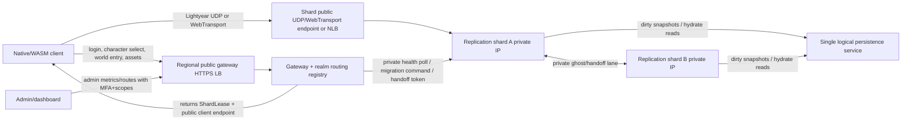
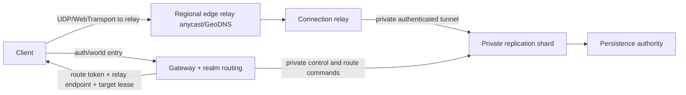
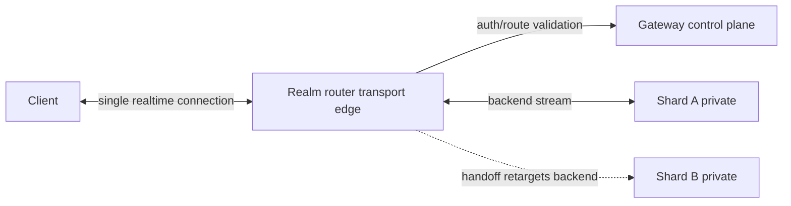

# Production Gateway / Realm / Routing Topology Analysis

Status: Archived
Lifecycle: historical-report
Category: report
Last updated: 2026-06-04
Owners: report author
Scope: Production Gateway / Realm / Routing Topology Analysis.
Source of truth: no
Supersedes: n/a
Superseded by: n/a
Primary references:
- n/a

Date: 2026-05-29
Status: docs-only production architecture planning pass
Owners: gateway + replication + persistence + operations
Scope: future production gateway, realm routing, endpoint advertisement, shard deployment, and handoff topology for Sidereal multiplayer shards.

Primary references:

- `AGENTS.md`
- `docs/decisions/dr-0040_distribution_and_persistence_authority_model.md`
- `docs/decisions/dr-0035_f64_world_coordinates.md`
- `docs/plans/completed/distribution_scaling_and_single_shard_hardening_plan_2026-05-21.md`
- `docs/reports/design-notes/phase_8_dynamic_migration_design_note_2026-05-28.md`
- `docs/architecture/sidereal_design_document.md`
- `docs/features/active/server_observability_metrics_contract.md`

## 0. Status Note

2026-05-29: This report makes no code or route-behavior changes. It found no hard current-code assumption that makes production deployment impossible, so the requested STOP rule did not fire. The current route configuration is under-modeled for production because it mixes client transport endpoint data in `ShardTransportEndpoints` and keeps internal health/control/migration endpoints in separate env vars, but current docs explicitly describe the multi-process route config as a development scaffold rather than a product milestone (`docs/plans/completed/distribution_scaling_and_single_shard_hardening_plan_2026-05-21.md:312`, `docs/plans/completed/distribution_scaling_and_single_shard_hardening_plan_2026-05-21.md:314`, `docs/plans/completed/distribution_scaling_and_single_shard_hardening_plan_2026-05-21.md:338`, `docs/architecture/sidereal_design_document.md:507`).

## 1. Executive Summary

The recommended production path is:

1. Keep the gateway as the only public authority for auth, world-entry route lookup, route-token issuance, and endpoint selection. This preserves DR-0040's rule that clients consult the gateway for shard endpoints and that runtime shards do not redirect clients directly (`docs/decisions/dr-0040_distribution_and_persistence_authority_model.md:85`, `docs/decisions/dr-0040_distribution_and_persistence_authority_model.md:88`, `docs/decisions/dr-0040_distribution_and_persistence_authority_model.md:91`).
2. Define "realm service" first as a gateway subcomponent: the realm-routing registry. It owns the typed endpoint registry, `ShardRouteTable` view, `ShardLease` epochs/states, region ownership, shard registration health, and load-coordinator job metadata. It should not be a separately deployed service until gateway routing itself becomes a measured bottleneck; DR-0040 already permits later router split-out as a deployment change (`docs/decisions/dr-0040_distribution_and_persistence_authority_model.md:89`, `docs/decisions/dr-0040_distribution_and_persistence_authority_model.md:173`, `docs/plans/completed/distribution_scaling_and_single_shard_hardening_plan_2026-05-21.md:480`).
3. For the first production-ready topology, use direct public client transport endpoints per shard or per-shard load balancer target, while keeping health, control, migration command, ghost lane, and persistence endpoints private. This is the smallest production step from the current V1 direct client-to-shard model, which already returns shard transport endpoints from world entry and uses fresh-client handoff retargeting (`bins/sidereal-gateway/src/api.rs:653`, `bins/sidereal-gateway/src/api.rs:655`, `docs/decisions/dr-0040_distribution_and_persistence_authority_model.md:79`, `docs/plans/completed/distribution_scaling_and_single_shard_hardening_plan_2026-05-21.md:389`).
4. Move next to regional edge relays when direct public shards become operationally risky. Relays should terminate public UDP/WebTransport, enforce route credentials or pass them through to shards, and forward over private VPC links. Full gateway-proxied transport remains V2+ only, matching DR-0040's deferral (`docs/decisions/dr-0040_distribution_and_persistence_authority_model.md:151`, `docs/decisions/dr-0040_distribution_and_persistence_authority_model.md:152`, `docs/plans/completed/distribution_scaling_and_single_shard_hardening_plan_2026-05-21.md:402`, `docs/plans/completed/distribution_scaling_and_single_shard_hardening_plan_2026-05-21.md:477`).
5. Treat one realm as one logical persistence authority. Global regions can host compute shards, but cross-region persistence latency is a production risk, not something to hide in gateway routing. DR-0040 requires one logical `sidereal-persistence-service` durable graph writer, and persistence-internal sharding is explicitly deferred (`docs/decisions/dr-0040_distribution_and_persistence_authority_model.md:47`, `docs/decisions/dr-0040_distribution_and_persistence_authority_model.md:50`, `docs/decisions/dr-0040_distribution_and_persistence_authority_model.md:132`, `docs/decisions/dr-0040_distribution_and_persistence_authority_model.md:133`).

## 2. Current Assumptions Found In Code And Docs

| Current-state claim | Evidence |
|---|---|
| Sidereal is server-authoritative; authority flow is one-way and clients send intent only. | `AGENTS.md:49`, `AGENTS.md:50`, `docs/architecture/sidereal_design_document.md:25`, `docs/architecture/sidereal_design_document.md:26` |
| DR-0040 commits to a four-tier architecture: gateway, compute shards, centralized persistence service, client. | `docs/decisions/dr-0040_distribution_and_persistence_authority_model.md:35` |
| Runtime shards own compute authority over `ShardRegion`s and entity roots; the durable graph writer is one logical persistence service. | `docs/decisions/dr-0040_distribution_and_persistence_authority_model.md:39`, `docs/decisions/dr-0040_distribution_and_persistence_authority_model.md:40`, `docs/decisions/dr-0040_distribution_and_persistence_authority_model.md:47`, `docs/decisions/dr-0040_distribution_and_persistence_authority_model.md:48` |
| A `ShardLease` carries `shard_id`, `region`, `epoch`, `state`, expiry, and `transport_endpoints`. | `docs/decisions/dr-0040_distribution_and_persistence_authority_model.md:62`, `crates/sidereal-core/src/sharding.rs:283`, `crates/sidereal-core/src/sharding.rs:290` |
| The current route table maps one `ShardRegion` to one `ShardLease`. | `crates/sidereal-core/src/sharding.rs:313`, `crates/sidereal-core/src/sharding.rs:315`, `crates/sidereal-core/src/sharding.rs:327`, `docs/reports/design-notes/phase_8_dynamic_migration_design_note_2026-05-28.md:72` |
| The gateway owns the canonical `ShardRouteTable`, performs world-entry shard selection, and is the only normal client-consulted source for shard endpoints. | `docs/decisions/dr-0040_distribution_and_persistence_authority_model.md:85`, `docs/decisions/dr-0040_distribution_and_persistence_authority_model.md:86`, `docs/decisions/dr-0040_distribution_and_persistence_authority_model.md:88` |
| Current world entry returns `replication_transport`, `shard_lease`, `shard_region`, and tokens. | `crates/sidereal-core/src/gateway_dtos.rs:203`, `crates/sidereal-core/src/gateway_dtos.rs:213`, `bins/sidereal-gateway/src/api.rs:653`, `bins/sidereal-gateway/src/api.rs:661` |
| Gateway converts selected lease endpoints into the client transport response. | `bins/sidereal-gateway/src/api.rs:651`, `bins/sidereal-gateway/src/api.rs:657`, `bins/sidereal-gateway/src/api.rs:1217`, `bins/sidereal-gateway/src/api.rs:1224` |
| Current `ShardTransportEndpoints` has only UDP address, WebTransport address, and WebTransport certificate digest fields. | `crates/sidereal-core/src/sharding.rs:276`, `crates/sidereal-core/src/sharding.rs:280`, `crates/sidereal-core/src/gateway_dtos.rs:196`, `crates/sidereal-core/src/gateway_dtos.rs:200` |
| Current `SIDEREAL_GATEWAY_SHARD_ROUTES` is a comma/semicolon route-table env format for client transport endpoints only. | `docs/architecture/sidereal_design_document.md:524`, `bins/sidereal-gateway/src/api.rs:1227`, `bins/sidereal-gateway/src/api.rs:1269` |
| The single-route fallback derives public transport endpoint values from `REPLICATION_UDP_PUBLIC_ADDR` / `REPLICATION_WEBTRANSPORT_PUBLIC_ADDR`, falling back to bind addresses when unset. | `bins/sidereal-gateway/src/api.rs:1201`, `bins/sidereal-gateway/src/api.rs:1207`, `bins/sidereal-gateway/src/config.rs:253`, `bins/sidereal-gateway/src/config.rs:259` |
| The design doc already says not to advertise loopback replication endpoints to clients on another host; the native loopback rewrite is only a compatibility fallback. | `docs/architecture/sidereal_design_document.md:79`, `docs/architecture/sidereal_design_document.md:83` |
| Browser/WASM requires a WebTransport address and certificate digest from the gateway world-entry response. | `bins/sidereal-client/src/runtime/auth_net.rs:46`, `bins/sidereal-client/src/runtime/auth_net.rs:65`, `docs/architecture/sidereal_design_document.md:83` |
| V1 handoff uses brief fresh-client retargeting, not gateway-proxied transport. | `docs/decisions/dr-0040_distribution_and_persistence_authority_model.md:79`, `docs/plans/completed/distribution_scaling_and_single_shard_hardening_plan_2026-05-21.md:381`, `docs/plans/completed/distribution_scaling_and_single_shard_hardening_plan_2026-05-21.md:389` |
| Handoff route tokens are gateway-signed and source shards are only delivery vehicles. | `docs/decisions/dr-0040_distribution_and_persistence_authority_model.md:91`, `docs/decisions/dr-0040_distribution_and_persistence_authority_model.md:93`, `crates/sidereal-core/src/handoff_route_token.rs:31`, `crates/sidereal-core/src/handoff_route_token.rs:64` |
| Target shard auth accepts handoff tokens and validates them before binding a fresh connection. | `docs/decisions/dr-0040_distribution_and_persistence_authority_model.md:95`, `bins/sidereal-replication/src/replication/auth.rs:582`, `bins/sidereal-replication/src/replication/auth.rs:624` |
| Health polling, control routes, and migration command endpoints are configured separately from client transport routes. | `docs/architecture/sidereal_design_document.md:525`, `docs/architecture/sidereal_design_document.md:527`, `bins/sidereal-gateway/src/api.rs:1115`, `bins/sidereal-gateway/src/migration_command_dispatch.rs:16` |
| Replication health/internal HTTP currently hosts `/health`, `/spatial-partition`, and `POST /internal/v1/shard-migration-command`. | `bins/sidereal-replication/src/replication/health.rs:1069`, `bins/sidereal-replication/src/replication/health.rs:1113` |
| Migration command receivers require `Authorization: Bearer <SIDEREAL_INTER_SHARD_AUTH_TOKEN>`. | `docs/features/active/server_observability_metrics_contract.md:32`, `docs/features/active/server_observability_metrics_contract.md:37`, `bins/sidereal-replication/src/replication/health.rs:1064`, `bins/sidereal-replication/src/replication/health.rs:1082`, `bins/sidereal-replication/src/replication/health.rs:3962`, `bins/sidereal-replication/src/replication/health.rs:3987` |
| The ghost lane is internal TCP-framed bincode IPC, not public client transport, and it authenticates with `SIDEREAL_INTER_SHARD_AUTH_TOKEN`. | `bins/sidereal-replication/src/replication/ghost_lane.rs:1`, `bins/sidereal-replication/src/replication/ghost_lane.rs:35`, `bins/sidereal-replication/src/replication/ghost_lane.rs:12`, `bins/sidereal-replication/src/replication/ghost_lane.rs:22`, `bins/sidereal-replication/src/replication/ghost_lane.rs:487`, `bins/sidereal-replication/src/replication/ghost_lane.rs:500` |
| f64 authoritative world coordinates remain unchanged, including persistence and non-motion read models. | `docs/decisions/dr-0035_f64_world_coordinates.md:22`, `docs/decisions/dr-0035_f64_world_coordinates.md:30`, `docs/decisions/dr-0040_distribution_and_persistence_authority_model.md:118`, `docs/decisions/dr-0040_distribution_and_persistence_authority_model.md:126` |
| Phase 8 load coordination is gateway-local today and has not executed migration or route mutation yet. | `docs/features/active/server_observability_metrics_contract.md:39`, `docs/features/active/server_observability_metrics_contract.md:45`, `docs/features/active/server_observability_metrics_contract.md:52`, `docs/features/active/server_observability_metrics_contract.md:58` |

## 3. What "Realm Service" Should Mean

"Realm" should mean one logical playable universe boundary:

- one shard-region coordinate grid and lease namespace;
- one canonical route table view;
- one route-token issuer/revoker;
- one logical durable graph persistence authority;
- one set of shard registration, health, capacity, migration, and admission-control state;
- one auth/account namespace unless a later product decision permits cross-realm accounts.

For Phase B, the realm service should be a gateway subcomponent, not a separate binary. Name it `realm routing`, `realm registry`, or `realm router` in docs and future code. It is a gateway-owned control-plane module that publishes the existing `ShardRouteTable` view. Splitting it into a separate deployment later is safe because DR-0040 already defines the gateway/router route-table contract as protocol-stable (`docs/decisions/dr-0040_distribution_and_persistence_authority_model.md:85`, `docs/decisions/dr-0040_distribution_and_persistence_authority_model.md:89`).

Realm routing owns:

- `ShardRouteTable` derived from the typed endpoint registry;
- `ShardLease` epoch/state/expiry and region ownership transitions;
- shard registration identity and endpoint metadata;
- load-coordinator jobs, target-cool counters, cooldowns, and admission queues;
- route-token endpoint binding metadata once route tokens grow endpoint IDs;
- operator/admin read models for route and capacity state.

Gateway still owns:

- account auth, MFA, roles/scopes, dashboard/admin guards;
- world-entry API and character-scoped token issuance;
- asset HTTP delivery;
- handoff route-token signing and revocation;
- public API rate limits, CORS, and external TLS.

Runtime shards still own simulation authority, client fanout for connected clients, shard-local visibility delivery, and inter-shard ghost/handoff IPC. Persistence still owns durable graph writes and hydration reads.

## 4. Endpoint Taxonomy

| Endpoint class | Visibility | Producer | Consumer | Current mapping/evidence | Production rule |
|---|---|---|---|---|---|
| `gateway_https_public` | Public | Gateway LB/API | Clients, dashboard, operators | Gateway is auth/identity lifecycle (`docs/architecture/sidereal_design_document.md:40`); world entry returns shard route data (`bins/sidereal-gateway/src/api.rs:653`). | Public HTTPS only. Use regional DNS/LB, WAF/rate limits, normal gateway auth. |
| `gateway_assets_public` | Public authenticated | Gateway | Clients | Asset payload delivery is gateway HTTP (`AGENTS.md:88`). | Same public gateway surface; never move asset payload bytes onto replication transport. |
| `client_udp_public` | Public client transport | Shard, shard LB, or relay | Native clients | Current endpoint field is `udp_addr` (`crates/sidereal-core/src/sharding.rs:277`, `crates/sidereal-core/src/sharding.rs:280`). | Must be globally client-reachable; use DNS/LB where possible. Do not publish loopback/private IPs. |
| `client_webtransport_public` | Public client transport | Shard, shard LB, or relay | WASM/browser clients | Current endpoint field is `webtransport_addr` plus certificate digest (`crates/sidereal-core/src/sharding.rs:277`, `crates/sidereal-core/src/sharding.rs:280`; browser validation at `bins/sidereal-client/src/runtime/auth_net.rs:46`). | Public TLS/WebTransport endpoint with stable certificate/digest model. |
| `internal_health_url` | Private | Shard health/internal HTTP | Gateway/ops | Current env is `SIDEREAL_GATEWAY_SHARD_HEALTH_ENDPOINTS=shard_id,http://host:port/health;...` (`docs/architecture/sidereal_design_document.md:526`, `bins/sidereal-gateway/src/api.rs:1115`). | Private VPC/service-network only; never client-advertised. |
| `internal_migration_command_url` | Private | Shard health/internal HTTP | Gateway realm routing | Current env is `SIDEREAL_GATEWAY_SHARD_MIGRATION_COMMAND_ENDPOINTS=.../internal/v1/shard-migration-command` (`docs/architecture/sidereal_design_document.md:527`, `bins/sidereal-gateway/src/migration_command_dispatch.rs:16`). | Private only; bearer token today, mTLS/service identity in production. |
| `gateway_internal_handoff_token_url` | Private | Gateway internal API | Source shards | Current route is `POST /internal/v1/handoff-token` (`bins/sidereal-gateway/src/api.rs:251`, `docs/features/active/server_observability_metrics_contract.md:13`). | Private service-to-service only. Production should not rely on `GATEWAY_JWT_SECRET` fallback. |
| `gateway_internal_shard_load_alert_url` | Private | Gateway internal API | Shards | Current alert contract is internal HTTP `POST /internal/v1/shard-load-alert` (`docs/features/active/server_observability_metrics_contract.md:60`, `docs/features/active/server_observability_metrics_contract.md:64`). | Private service-to-service only; rate-limited and idempotent. |
| `internal_ghost_lane_addr` | Private | Shard TCP listener | Neighbor shards | Current ghost lane uses `SIDEREAL_GHOST_LANE_BIND` and `SIDEREAL_GHOST_LANE_PEER_ENDPOINTS` (`bins/sidereal-replication/src/replication/ghost_lane.rs:12`, `bins/sidereal-replication/src/replication/ghost_lane.rs:22`). | Private subnet/security group only. No client exposure. |
| `control_plane_addr` | Private | Replication control UDP or future control API | Gateway | Current env is `SIDEREAL_GATEWAY_SHARD_CONTROL_ROUTES=shard_id,control_udp_addr;...` (`docs/architecture/sidereal_design_document.md:525`). | Private only; replace UDP bootstrap semantics where ack/retry is required. |
| `persistence_ipc_addr` | Private | `sidereal-persistence-service` | Shards/gateway starter-world paths | Persistence service is single logical writer (`docs/decisions/dr-0040_distribution_and_persistence_authority_model.md:47`); default IPC bind is local in current docs (`docs/architecture/sidereal_design_document.md:71`). | Private service-network only; no public ingress. |
| `admin_metrics_public_or_private` | Restricted admin | Gateway | Operators/dashboard proxy | Metrics endpoints require gateway tokens with admin/dev role, MFA, and scopes (`docs/features/active/server_observability_metrics_contract.md:241`, `docs/features/active/server_observability_metrics_contract.md:246`, `docs/features/active/server_observability_metrics_contract.md:341`, `docs/features/active/server_observability_metrics_contract.md:346`). | Prefer VPN/private admin access; if public, require MFA/scopes and audit. |

## 5. Recommended Production Topology

Phase B should make production direct-shard routing explicit:

- Clients authenticate and perform world entry through a public regional gateway endpoint.
- Gateway realm routing returns a public client endpoint class (`client_udp_public` for native, `client_webtransport_public` for browser), the `ShardLease`, the `ShardRegion`, and character-scoped auth.
- Shard internals stay private: health, migration commands, control, ghost lane, and persistence.
- Shard public client endpoints should be stable DNS/LB endpoints, not raw instance-local private IPs. A public endpoint can target a raw public shard IP in small deployments, but the route registry must model it as an advertised endpoint independent from the shard's private service endpoints.



Phase C should introduce regional transport relays when direct shard exposure becomes expensive to defend:



Phase D remains optional V2+ gateway/realm-router transport proxying:



## 6. Client Discovery Flow

Initial login and character selection:

1. Client connects to a public gateway DNS name, ideally `https://gateway.<region>.<realm>.sidereal.example`.
2. Gateway authenticates account/MFA and returns account/character state. Current design requires character-scoped world entry tokens rather than treating login as runtime bind (`docs/architecture/sidereal_design_document.md:563`, `docs/architecture/sidereal_design_document.md:571`, `docs/architecture/sidereal_design_document.md:579`).

World entry:

1. Client calls Enter World for a selected `player_entity_id`.
2. Gateway realm routing loads the player's world position, computes `ShardRegion`, selects the matching `ShardLease`, and returns public client endpoints. Current implementation already selects via `select_world_entry_route` and returns endpoint-derived `replication_transport` (`bins/sidereal-gateway/src/api.rs:645`, `bins/sidereal-gateway/src/api.rs:657`, `bins/sidereal-gateway/src/api.rs:782`, `bins/sidereal-gateway/src/api.rs:811`).
3. Client connects to the returned UDP or WebTransport endpoint and authenticates to the shard with the world-entry token.

Handoff:

1. Source and target shards perform internal Prepare/Commit over the private inter-shard lane; source persists final dirty state and target hydrates from the same service (`docs/decisions/dr-0040_distribution_and_persistence_authority_model.md:76`, `docs/decisions/dr-0040_distribution_and_persistence_authority_model.md:80`, `docs/plans/completed/distribution_scaling_and_single_shard_hardening_plan_2026-05-21.md:385`, `docs/plans/completed/distribution_scaling_and_single_shard_hardening_plan_2026-05-21.md:388`).
2. Source shard obtains or carries a gateway-signed route token and sends it to the client. Current DTO returns both `signed_route_token` and `target_shard_endpoints` (`crates/sidereal-core/src/gateway_dtos.rs:226`, `crates/sidereal-core/src/gateway_dtos.rs:241`, `bins/sidereal-gateway/src/api.rs:679`, `bins/sidereal-gateway/src/api.rs:682`).
3. Client replaces its replication transport from the message's `target_shard_endpoints` and creates a fresh connection (`bins/sidereal-client/src/runtime/handoff.rs:503`, `bins/sidereal-client/src/runtime/handoff.rs:510`).
4. Target shard validates the handoff token and lease epoch before binding the connection (`docs/decisions/dr-0040_distribution_and_persistence_authority_model.md:95`, `bins/sidereal-replication/src/replication/auth.rs:613`, `bins/sidereal-replication/src/replication/auth.rs:620`).

DNS/LB options:

- Gateway public endpoints: GeoDNS or anycast to closest regional gateway. HTTP auth/assets tolerate normal HTTP load-balancing and retries.
- Direct shard public endpoints: prefer `shard-<id>.<region>.<realm>.sidereal.example` CNAMEs or per-shard NLB DNS names. Avoid returning instance private IPs. Avoid returning loopback; current docs already warn that loopback advertisement is a misconfiguration for remote clients (`docs/architecture/sidereal_design_document.md:79`, `docs/architecture/sidereal_design_document.md:83`).
- Relay endpoints: return `relay.<region>.<realm>.sidereal.example` plus route token. The relay chooses private target shard from token/registry.
- WebTransport: return a public HTTPS/WebTransport origin and certificate digest or move to standard public CA validation once the browser transport adapter supports it.

## 7. Should Replication Shards Be Directly Public?

| Option | Pros | Cons | Handoff behavior | Recommendation |
|---|---|---|---|---|
| Direct public shard UDP/WebTransport endpoints | Lowest runtime latency, smallest change from V1 direct transport, simple route-token semantics. | Exposes every shard transport surface, harder DDoS posture, public IP/LB lifecycle must be synchronized with route registry. | Client closes source transport and opens target endpoint from gateway-signed token. Prepare/commit remains private. | Phase B baseline if protected by firewall/LB and explicit endpoint registry. |
| Public per-region shard load balancers | Hides raw machines, supports health-drained targets, centralizes TLS/WebTransport certs. | Needs strong connection affinity; UDP/WebTransport target selection can be awkward without per-shard listener/port/DNS. | Same as direct, but route endpoint is LB DNS/port. | Prefer over raw public machine IPs where cloud LB supports the needed transport. |
| Edge relay / connection server | Keeps shards private, better DDoS/NAT posture, can support stable regional endpoints and later smoother handoff. | Adds hop latency and relay capacity engineering; relay becomes transport-critical. | Client reconnects to relay endpoint or keeps relay session while relay retargets private shard. Token binds target shard/lease. | Phase C preferred production hardening after Phase B. |
| Full gateway-proxied transport | Simplest client endpoint story, shards entirely private, gateway can switch backend without client retarget. | Contradicts V1 direct route, risks gateway bottleneck, mixes HTTP auth/assets with realtime fanout, requires major client/server transport work. | Client keeps one connection; gateway/router switches backend after target commit. | Do not build yet; V2+ only. |
| Hybrid gateway auth/routing + edge relays for transport | Preserves DR-0040 gateway authority while keeping realtime edge separate from auth/assets. | Requires a typed registry and relay service identity. | Route token names relay endpoint and target shard/lease; relay forwards private. | Recommended long-term topology. |

## 8. Cloud Deployment Model

Single VPC/private network:

- Put shards, persistence, and gateway private interfaces in private subnets.
- Expose gateway public HTTPS through an ingress/LB.
- Expose only `client_udp_public` and `client_webtransport_public` for shard client transport, or expose no shard transport if relays are present.
- Restrict `internal_health_url`, `internal_migration_command_url`, `internal_ghost_lane_addr`, `control_plane_addr`, and persistence IPC to private security groups.

Multiple availability zones:

- Run gateway replicas in at least two zones behind one regional public HTTP LB.
- Run shards in private subnets across zones. Realm routing tracks `region`, `zone`, public endpoint, private endpoints, state, lease epoch, and capacity.
- Put public shard NLBs or relays in public subnets with target health checks that do not expose internal `/health` to clients.
- Keep ghost/handoff lanes low-latency; cross-AZ is acceptable but should be measured against Phase 7 SLOs (`docs/plans/completed/distribution_scaling_and_single_shard_hardening_plan_2026-05-21.md:375`, `docs/plans/completed/distribution_scaling_and_single_shard_hardening_plan_2026-05-21.md:400`).

Multiple geographic regions:

- Use regional gateways for login/world-entry latency and regional client transport endpoints.
- Do not assume all shards share one LAN. The endpoint registry must distinguish `public client endpoint`, `private same-region endpoint`, and `cross-region service endpoint`.
- A single global realm with one centralized persistence authority will add hydrate/commit latency for far regions. Since DR-0040 keeps one logical durable writer and defers geographic routing and persistence-internal sharding (`docs/decisions/dr-0040_distribution_and_persistence_authority_model.md:132`, `docs/decisions/dr-0040_distribution_and_persistence_authority_model.md:133`, `docs/decisions/dr-0040_distribution_and_persistence_authority_model.md:171`), production should either keep one realm mostly in one geographic region or operate separate realms per geography until a persistence-scaling DR exists.

New shard registration:

1. Orchestrator assigns `shard_id`, allowed `ShardRegion` candidates, `region`, `zone`, and service identity.
2. Shard starts with private bind addresses for health, migration command, ghost lane, control plane, and persistence.
3. Transport layer provisions either direct public shard endpoints, per-shard LB endpoints, or relay routes.
4. Shard registers all endpoint classes with gateway realm routing over a private authenticated control-plane call.
5. Realm routing validates endpoint reachability and health, then creates or updates leases.
6. Clients see only `client_udp_public`, `client_webtransport_public`, or relay endpoints in world-entry/handoff responses.

## 9. Persistence And Realm Boundaries

DR-0040's persistence rule is the limiting architecture constraint: runtime shards stream dirty snapshots to one logical `sidereal-persistence-service`, and target shards hydrate from the same service (`docs/decisions/dr-0040_distribution_and_persistence_authority_model.md:47`, `docs/decisions/dr-0040_distribution_and_persistence_authority_model.md:49`, `docs/decisions/dr-0040_distribution_and_persistence_authority_model.md:80`).

Therefore:

- One realm should imply one logical persistence authority.
- Separate global regions that need low-latency handoff should probably be separate realms until a future persistence-scaling DR exists.
- Cross-region compute shards in one realm are acceptable only if handoff/hydration latency remains inside measured SLOs or if those regions do not perform frequent cross-region handoff.
- Do not introduce per-shard durable graph writers or region-local graph writers. DR-0040 rejected distributed/per-shard persistence (`docs/decisions/dr-0040_distribution_and_persistence_authority_model.md:148`, `docs/decisions/dr-0040_distribution_and_persistence_authority_model.md:149`).

Out of scope until a future persistence-scaling DR:

- active-active graph writers;
- cross-region consensus for entity handoff;
- per-realm internal persistence sharding semantics;
- cross-realm inventory/account transfer semantics;
- changing f64 coordinate authority or persistence precision.

## 10. Security Model

Public surfaces:

- Gateway HTTPS: login, character selection, world entry, assets, diagnostics upload, and admin/dashboard routes.
- Shard or relay client transport: only UDP/WebTransport runtime transport. No health/control/migration/persistence routes.

Private surfaces:

- Shard health/internal HTTP, including migration command receiver.
- Gateway internal handoff-token mint and shard-load-alert endpoints.
- Ghost/handoff TCP IPC.
- Replication control plane.
- Persistence IPC and persistence health.

Credential boundaries:

- Client auth uses gateway-issued account/world tokens and handoff route tokens.
- Route tokens must remain short-lived, signed by gateway, and bound to `player_entity_id`/entity root, target shard, lease epoch, handoff sequence, and eventually endpoint ID/relay ID. Current claims carry entity ID, target shard, lease epoch, sequence, issue time, and expiry (`crates/sidereal-core/src/handoff_route_token.rs:11`, `crates/sidereal-core/src/handoff_route_token.rs:19`).
- Internal service-to-service traffic should use mTLS or workload identity. Existing shared bearer token paths are acceptable for current dev/internal scaffolding but should not be the only production control-plane identity (`docs/features/active/server_observability_metrics_contract.md:28`, `docs/features/active/server_observability_metrics_contract.md:35`).
- Production must not rely on development fallback secrets for handoff minting. Current gateway code falls back from `SIDEREAL_GATEWAY_HANDOFF_MINT_SECRET` to `GATEWAY_JWT_SECRET` (`bins/sidereal-gateway/src/api.rs:1830`, `bins/sidereal-gateway/src/api.rs:1844`); production config should require a distinct internal secret or mTLS-authenticated mint request.

Preventing arbitrary shard selection:

- Clients must never supply raw shard addresses as authority. They receive endpoints through gateway world entry or a gateway-signed handoff route token.
- Shard/relay should reject client-provided target shard IDs unless the credential matches the currently active or staged lease.
- Realm routing should include endpoint IDs in route-token claims once typed registry lands, so a token for shard 12/epoch 4 cannot be replayed against an old public endpoint for shard 12/epoch 3.

## 11. Handoff Behavior By Topology

| Topology | Client reconnect behavior | Token validation | Public endpoint returned | Internal source-target path | Latency tradeoff | Failure modes |
|---|---|---|---|---|---|---|
| Direct public shard endpoint | Fresh Lightyear client to target shard public UDP/WebTransport endpoint. | Target shard validates gateway HMAC token and lease epoch. | Target shard DNS/IP/port from `client_udp_public` or `client_webtransport_public`. | Private ghost/handoff TCP plus persistence snapshot/hydrate. | Lowest extra network hop; connection setup cost remains. | Endpoint stale, public IP rotation, UDP blocked, target LB unhealthy, token expiry. |
| Public per-shard/per-region LB | Fresh client to LB endpoint mapped to target shard. | Target shard still validates token; LB is transport pass-through. | LB DNS/port; route registry maps it to shard lease. | Same private prepare/commit. | Small LB hop; better operational shielding. | LB target health lag, wrong affinity, port exhaustion, cert mismatch for WebTransport. |
| Edge relay | Fresh client to relay endpoint, or future persistent relay session retarget. | Relay validates route token or forwards token for shard validation; shard remains final authority. | Relay DNS/port plus token-bound target shard metadata. | Relay-to-shard private tunnel; shard-to-shard prepare/commit remains private. | Extra hop, but better NAT/DDoS and stable endpoint behavior. | Relay overload, relay-target routing stale, token validation split-brain, regional relay outage. |
| Full gateway/realm-router proxy | Client keeps one realtime connection to router. | Router validates token/route and switches backend after commit. | Gateway/router transport endpoint only. | Router-to-shard private stream plus shard prepare/commit. | Can hide handoff reconnect but makes router a high-throughput realtime dependency. | Gateway/router bottleneck, realtime/auth blast radius, complex backpressure, harder failure isolation. |

## 12. Failure Modes To Design For

| Failure | Impact | Mitigation |
|---|---|---|
| Gateway route registry down | New login/world-entry and handoff token minting fail. Existing direct shard sessions can continue until handoff/reconnect. | Replicated gateway instances; persist route registry; shard-side graceful degradation; clients retry gateway. |
| Gateway route table stale | Client receives endpoint for wrong lease or retired shard. | Lease epochs in tokens and auth; target rejects mismatched epoch; health polling degrades stale routes; typed registry versioning. |
| Public shard endpoint advertises private/loopback IP | Remote clients fail to connect. | Registry validation rejects loopback/private addresses for public classes; current docs already warn not to advertise loopback to remote clients (`docs/architecture/sidereal_design_document.md:79`). |
| Internal health/control endpoint exposed publicly | Attackers can observe or command shards. | Separate endpoint classes, security groups, mTLS, bearer tokens, no public DNS, audit. |
| Migration command endpoint unreachable | Region migration stalls in planned/dispatch failed state. | Retry and idempotent acks already exist for dispatch (`bins/sidereal-gateway/src/migration_command_dispatch.rs:20`, `bins/sidereal-gateway/src/migration_command_dispatch.rs:260`); surface operator alerts. |
| Ghost lane interruption | Border visibility and handoff prepare/commit messages degrade. | Bounded retry/reconnect exists in ghost producer path (`bins/sidereal-replication/src/replication/ghost_lane.rs:19`, `bins/sidereal-replication/src/replication/ghost_lane.rs:22`); health metrics should mark peer state. |
| Persistence latency across regions | Handoff prepare/commit and hydration exceed SLO. | Keep realm and persistence region close to active shards; avoid cross-region handoff until future persistence DR. |
| Route-token signing key leak | Clients can attempt unauthorized target bind. | Short TTL, key rotation, endpoint/lease binding, shard-side pending-handoff validation, service identity isolation. |
| Relay overload | Clients lose realtime transport despite healthy shards. | Relay autoscaling, per-region fallback relay pools, backpressure metrics, direct endpoint fallback only if explicitly permitted. |
| Load coordinator state lost | In-flight migration/admission state may be forgotten. | Current Phase 8 report flags route-table state as in-memory (`docs/reports/design-notes/phase_8_dynamic_migration_design_note_2026-05-28.md:77`); production registry should persist lease/job state or recover idempotently from shard health and lease epochs. |

## 13. Migration Path From Env Vars To Typed Service Registry

The current env vars should remain for local/dev:

- `SIDEREAL_GATEWAY_SHARD_ROUTES`
- `SIDEREAL_GATEWAY_SHARD_CONTROL_ROUTES`
- `SIDEREAL_GATEWAY_SHARD_HEALTH_ENDPOINTS`
- `SIDEREAL_GATEWAY_SHARD_MIGRATION_COMMAND_ENDPOINTS`

Production should add a typed registry that can initially be loaded from a file or database row and later accept authenticated shard registration. The gateway should derive the existing `ShardRouteTable` from this registry.

Suggested registry shape:

```yaml
realm_id: "sidereal-prod-na"
persistence_authority:
  endpoint_class: "persistence_internal"
  ipc_addr: "sidereal-persistence.service.consul:9010"
  home_region: "us-east-1"
shards:
  - shard_id: 12
    process_id: "sidereal-replication-12-20260529-a"
    region: "us-east-1"
    zone: "us-east-1a"
    lease_state: "active"
    lease_epoch: 4
    owned_regions:
      - { x: 0, y: 0 }
    endpoints:
      client_udp_public:
        host: "shard-12.us-east-1.sidereal.example"
        port: 7001
      client_webtransport_public:
        url: "https://shard-12.us-east-1.sidereal.example:7003"
        cert_sha256: "<digest>"
      internal_health_url:
        url: "http://10.0.42.12:15716/health"
      internal_migration_command_url:
        url: "http://10.0.42.12:15716/internal/v1/shard-migration-command"
      internal_ghost_lane_addr:
        addr: "10.0.42.12:9100"
      control_plane_addr:
        addr: "10.0.42.12:9004"
```

Phased registry rollout:

1. Add typed config ingestion without changing runtime behavior. It produces the current route table and internal endpoint maps.
2. Add validation: public endpoint classes must not be loopback/private, internal endpoint classes must not be public, all endpoint hosts must match region/zone metadata, and WebTransport entries must include certificate configuration.
3. Add admin/dashboard read-only registry view beside the existing shard-routes and load-coordinator views.
4. Add shard self-registration through a private control-plane API with mTLS/workload identity.
5. Persist registry and lease/job state so gateway restart does not erase in-flight migration context.
6. Add route-token endpoint IDs only after the registry is canonical.
7. Deprecate production use of comma-separated env vars while retaining them for local/dev and tests.

## 14. What Not To Build Yet

- Do not implement full gateway-proxied transport as part of this planning pass. DR-0040 and the plan keep that as V2+ fallback (`docs/decisions/dr-0040_distribution_and_persistence_authority_model.md:151`, `docs/decisions/dr-0040_distribution_and_persistence_authority_model.md:152`, `docs/plans/completed/distribution_scaling_and_single_shard_hardening_plan_2026-05-21.md:402`).
- Do not split the realm router out of gateway before the gateway route/capacity path is measured as a bottleneck.
- Do not introduce per-shard or per-region durable graph writers. DR-0040 rejected distributed/per-shard persistence (`docs/decisions/dr-0040_distribution_and_persistence_authority_model.md:148`, `docs/decisions/dr-0040_distribution_and_persistence_authority_model.md:149`).
- Do not expose health, control, migration command, ghost lane, or persistence endpoints to clients.
- Do not assume every shard machine IP must be public. Public endpoints should be route-advertised transport endpoints, not necessarily raw machine IPs.
- Do not build cross-region active-active handoff or persistence before a persistence-scaling DR.
- Do not create production chaos/link-conditioner routing branches. Link conditioner env vars are diagnostic-only and not production knobs (`AGENTS.md:136`).
- Do not change DR-0035 coordinate precision or persistence/read-model f64 contracts.
- Do not silently extend route tokens to carry new endpoint claims until all producers/consumers can validate one canonical schema.

## 15. Open Decisions For User

1. Realm geography: should production launch as one global realm with one home persistence region, or multiple geography-local realms with separate persistence authorities?
2. Phase B exposure: are direct public shard endpoints acceptable for first production, or should Sidereal skip directly to edge relays before any public test?
3. Registry backing store: gateway database, Kubernetes/API discovery, Consul/etcd, or a small purpose-built realm registry table?
4. Public endpoint granularity: per-shard DNS, per-region LB with per-shard ports, or relay-only stable regional endpoints?
5. WebTransport certificate model: keep explicit digest advertisement, move to public CA trust, or support both during transition?
6. Internal service identity: mTLS/service mesh, signed service JWTs, or short-lived workload credentials?
7. Route-token evolution: should route tokens bind to `endpoint_id`/`relay_id` in Phase B, or wait until Phase C relay work?
8. Gateway/router split trigger: what measured route lookup, token mint, or load-coordinator threshold justifies a separate realm-router deployment?
9. Persistence SLO: what max hydrate/commit p95 is acceptable for cross-AZ and cross-region handoff before requiring a realm split?
